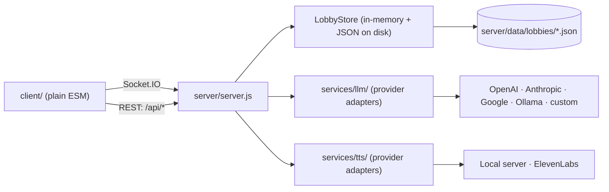

# Architecture

## Shape of the system

A single Node process serves the static browser client and holds all game state
in memory, persisting each lobby to `server/data/lobbies/<lobbyId>.json`. There
is no database and no build step: the client is plain ESM loaded directly by the
browser. Realtime traffic is Socket.IO; a handful of REST endpoints cover
listing, feature detection, character import/export, and media.

## The game loop

The server, not the browser, drives play. This is the single most important
constraint on the system, and the reason AI credentials must live server-side:

1. A player submits an action (`action:submit`), **or** their turn timer expires
   (`server/routes/turnTimer.js`), **or** a background summarization fires
   (`LobbyStore.autoSummarize`). The last two have no client in the loop at all.
2. The server composes a prompt from lobby state (`lobbyPrompts.js`) and calls
   the configured model through `services/llmGateway.js`, which resolves whose
   credential pays — the host's, the instance's, or none for a local service.
3. The DM's reply is expected to be JSON. `server/helpers/parseDMJson.js` parses
   it through five escalating repair stages, two of which call the model again
   to repair malformed output.
4. The parsed object is applied to lobby state — HP, XP, inventory, conditions,
   initiative, map, music mood, sound effects — and broadcast to the room.

Because steps 1–3 can begin without any connected client, an AI configuration
must be resident on the server for the whole lifetime of a running lobby.

## Lobby state

`LobbyStore` (`server/services/lobbyStore.js`) owns one object per lobby, split
across mixins in `server/services/lobby/`: `lobbySettings`, `lobbyPlayers`,
`lobbyHistory`, `lobbyCombat`, `lobbyProgression`, `lobbyPrompts`. Every mutation
calls `persist(lobbyId)`, which writes the entire lobby object to disk.

**Invariant: no secret may be reachable from a `LobbyStore` object.** Because
`persist` serialises the whole object, anything stored there lands in a
world-readable JSON file. AI credentials are therefore held in a separate
in-memory store keyed by lobby id and are never written to disk — see
[modules/credentials.md](modules/credentials.md) and
[ADR 0001](decisions/0001-player-supplied-ai-credentials.md).

Credential state lives in three places with three lifetimes, and it is worth
knowing which holds what: the operator's own keys are encrypted on disk
(`credentials.enc`), who may spend them is plain JSON (`provider-policy.json`),
and a host's supplied key is memory-only for the life of their connection.

Non-secret AI settings (`llmProvider`, `llmModel`) do live in lobby state and are
published to clients through `publicState`, as do the narration settings
(`ttsProvider`, `narratorVoiceId`). The local TTS server's URL is the exception:
it is operator configuration (`LOCAL_TTS_URL`) rather than lobby state, because
the server issues that request and a host-editable field would be an SSRF vector
— see [ADR 0005](decisions/0005-pluggable-tts-with-a-local-server.md).

## Boundaries

| Boundary | Rule |
|---|---|
| Browser → server | Everything is untrusted. AI configuration is normalized once at the edge by `services/llm/config.js`; character sheets are re-validated server-side. |
| Server → provider | All provider traffic goes through `services/llm/`. No other module constructs a provider client or reads a provider key. |
| Lobby state → disk | `persist()` writes the whole object; secrets must never be reachable from it. |
| Host vs. player | `store.isHost(lobbyId, socket.id)` gates settings changes, game start, and kicks. The host's AI configuration is the one the lobby runs on. |

## Client

The client has no framework and no bundler. `client/app.js` holds shared state,
`client/sockets.js` registers socket handlers, `client/eventHandlers.js` holds UI
callbacks, and `client/components/*.html` are self-contained fragments opened as
separate windows (the settings menu is `components/options.html`, which talks to
the server through `window.opener.socket`).

Browser-side persistence is `localStorage`, used today for narration toggle and
story font, and — as of the AI credentials work — for the player's AI
configuration.

The admin console is the exception to "no framework, no structure": it is a
routed, state-driven application in its own right, and has its own document —
[modules/admin-console.md](modules/admin-console.md).

## Not yet audited

The following were not read end to end while writing this document and should be
verified before being relied on: the map service and the SFX resolution path. One
known defect: `server/routes/turnTimer.js:175` dynamically imports
`../services/sfxResolver.js`, which does not exist, so epilogue sound effects
never play.

The admin panel is no longer on this list — it was read end to end and rebuilt;
see the module document above.

_Last verified: 2026-07-27 against branch `Refactor` (5fcf307)._
