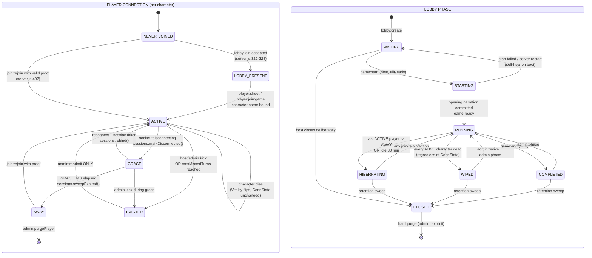

# Edge-Case Handling Specification — StoryTeller Lifecycle & Failure Modes

**Scope:** lifecycle transitions and failure modes. Event-delivery reliability (`eventJournal.js` / `eventTaxonomy.js`) is a sibling audit; this spec references its seam but does not define it.

**Status:** normative. Every "MUST" below is testable; §6 gives the assertions.

---

## 0. Executive framing — three finished modules are not wired in

Before designing anything, note what already exists in the tree, fully written and unit-tested, imported by **nothing**:

| Module | Implements | Importers today |
|---|---|---|
| `server/services/playerSessions.js` (+ `.test.js`) | Durable identity surviving socket-id churn; `ACTIVE`/`GRACE` states; `DEFAULT_GRACE_MS = 90_000`; `open` / `rebind` / `markDisconnected` / `sweepExpired` / `byPlayer` / `listLobby` / `close` / `dropLobby` | **zero** |
| `server/services/llm/{errors,registry,config,http}.js` (+ tests) | `LLMRequestError` with `.kind`, `.retryable`, `.userMessage()`, `classifyHttpStatus`, token scrubbing, provider registry, `resolveLLMConfig` | **zero** |
| `server/services/eventJournal.js`, `eventTaxonomy.js` (+ tests) | `DURABLE`/`EPHEMERAL`/`SNAPSHOT` classification, replay | **zero** (sibling audit) |

`playerSessions.js:20-25` states the grace rationale verbatim; `llm/errors.js:22` already defines `RETRYABLE_KINDS = {rate_limit, server, network}`. **Roughly 60% of this specification is a wiring task, not a design task.** The live code paths — `server/server.js:1017-1089`, `server/services/llmService.js:155-158`/`199-202` — predate these modules and were never migrated. Sections 1, 3 and 4 below are written to be satisfiable by wiring them; the constants named match the constants those modules already export.

---

## 1. Canonical state machine

### 1.1 Three orthogonal axes

Today the code conflates them, which is the direct cause of `checkalldead-ignores-disconnected-survivors` (a *connection* fact decides a *vitality* question) and `dead-player-cannot-return-even-as-spectator` (a *vitality* fact decides a *participation* question). They MUST be separate fields.

```js
// server/services/lobby/constants.js  (new)
export const ConnState = Object.freeze({
  NEVER_JOINED: "never_joined",   // no record anywhere
  LOBBY_PRESENT: "lobby_present", // socket in room, no character yet  (today: sockets[sid].playerName === null)
  ACTIVE:        "active",        // live socket bound to a character
  GRACE:         "grace",         // socket gone, seat HELD, ≤ GRACE_MS
  AWAY:          "away",          // grace lapsed, seat RELEASED, character reclaimable
  EVICTED:       "evicted",       // kicked by host/admin/inactivity; character preserved, re-entry gated
});

export const Vitality = Object.freeze({
  ALIVE: "alive",
  DEAD:  "dead",
});

export const Participation = Object.freeze({
  IN_TURN_ORDER: "in_turn_order",
  SPECTATOR:     "spectator",     // in room, receives everything, never in `initiative`
});
```

`ConnState.ACTIVE` / `ConnState.GRACE` map 1:1 onto the `ACTIVE` / `GRACE` string constants already declared at `playerSessions.js:28,31`.

**Derivation rule (invariant INV-7):** `Participation` is *derived*, never stored independently:

```
Participation = (Vitality === DEAD || ConnState ∈ {AWAY, EVICTED}) ? SPECTATOR : IN_TURN_ORDER
```

`ConnState.GRACE` therefore keeps `IN_TURN_ORDER` — that is the entire point of the grace window (§3).

### 1.2 Lobby phases

Current set (`lobbyStore.js:100`, `lobbyCombat.js:16-21,28-40`, `turnTimer.js:140`, `server.js:942`): `waiting`, `running`, `hibernating`, `wiped`, `completed`. Two additions are required:

```js
export const Phase = Object.freeze({
  WAITING:     "waiting",
  STARTING:    "starting",     // NEW
  RUNNING:     "running",
  HIBERNATING: "hibernating",
  WIPED:       "wiped",        // terminal
  COMPLETED:   "completed",    // terminal
  CLOSED:      "closed",       // NEW — terminal tombstone, replaces fs.unlinkSync
});
```

- **`STARTING`** exists because `store.startGame()` (`lobbyCombat.js:28-40`) sets `phase = "running"` and persists **before** the two LLM calls at `server.js:669-672`. A crash in that window persists `{phase:"running", history:[]}`, and `client/sockets.js:71-73` then shows an undismissable overlay to every rejoining player forever. `STARTING` makes that window an explicit, recoverable state.
- **`CLOSED`** exists because `store.deleteLobby` (`lobbyStore.js:80-88`) `fs.unlinkSync`s the file. A host pressing F5 during character creation hits `server.js:1027-1039` and irreversibly destroys four players' work with no confirmation. A tombstone is reversible; an unlink is not.

### 1.3 Diagram



### 1.4 Transition table (triggers and side effects)

| From | To | Trigger | Required side effects | Currently |
|---|---|---|---|---|
| `NEVER_JOINED`→`LOBBY_PRESENT` | | `lobby:join` accepted, phase `WAITING` | `socket.join`, `addConnection`, `sendState` | ✔ `server.js:322-328` |
| `LOBBY_PRESENT`→`ACTIVE` | | `player:sheet` with unique normalized name | issue `sessionToken`, `upsertPlayer` | ✘ no token, no uniqueness (`server.js:538-550`) |
| `ACTIVE`→`GRACE` | | socket `disconnecting` | **nothing destructive**; emit `player:grace`; keep initiative slot | ✘ removes from turn order immediately (`server.js:1048`) |
| `GRACE`→`ACTIVE` | | reconnect presenting `sessionToken` | `rebind`, re-`socket.join`, replay snapshot, emit `player:returned` | ✘ no reconnect handler at all (`client/sockets.js:726-728` emits only `lobbies:watch`) |
| `GRACE`→`AWAY` | | `GRACE_MS` elapsed (`sweepExpired`) | `removeFromTurnOrder`, `player:left`, `turn:update`, re-arm timer, maybe hibernate | ✘ happens at t=0 instead |
| `AWAY`→`ACTIVE` | | `join:rejoin` with proof | `insertIntoInitiative`, clear `disconnected`, **`resetMissedTurns`** | partial — missed turns never reset (`resetMissedTurns` sole caller is `server.js:766`) |
| `*`→`EVICTED` | | kick | `removeFromTurnOrder` + `turn:update` + preserve `players[name]` | ✘ `kickPlayer` (`lobbyPlayers.js:249-257`) deletes the record and skips initiative |
| `EVICTED`→`ACTIVE` | | `admin:readmit` | restore, re-insert | ✘ operation does not exist |
| `ALIVE`→`DEAD` | | `markPlayerDead` | `removeFromTurnOrder`, `Participation=SPECTATOR`, keep in room | ✔ `gameUpdates.js:80-90` |
| `DEAD`→`ALIVE` | | `admin:revive` | clear `dead`, restore HP, `insertIntoInitiative` | ✘ **nothing in the repo ever clears `dead`** |
| `WAITING`→`STARTING` | | `game:start` | persist `STARTING`; hold `history` empty | ✘ jumps straight to `RUNNING` (`lobbyCombat.js:31`) |
| `STARTING`→`RUNNING` | | opening narration committed | `appendDM` **then** `setPhase(RUNNING)` **then** `game:ready` | ✘ order inverted (`server.js:659` vs `:699`) |
| `STARTING`→`WAITING` | | boot sweep finds `STARTING` | reset, toast host | ✘ boot sweep does not exist |
| `RUNNING`→`WIPED` | | all **ALIVE** characters dead | epilogue, `ui:unlock`, `game:over` | ✘ predicate excludes `disconnected` (`lobbyCombat.js:235`) |

---

## 2. Join and rejoin — one unified decision table

### 2.1 Normalization at the boundary (CQ-6)

All four entry points (`lobby:join` `server.js:288`, `join:rejoin` `:407`, `player:join:game` `:459`, `player:sheet` `:538`) MUST funnel through one function:

```js
// server/helpers/identity.js  (new)
export function canonicalName(raw) {
  if (typeof raw !== "string") return null;
  const s = raw.normalize("NFKC")           // folds width/compat variants
    .replace(/[_\u00A0]/g, " ")             // matches normalizeName (utils.js:8-13)
    .replace(/\s+/g, " ")
    .trim();
  if (s.length < 1 || s.length > 32) return null;
  if (!/^[\p{L}\p{N} '\-.]+$/u.test(s)) return null;  // rejects control chars, markup
  return s;
}
export const nameKey = (raw) => {
  const c = canonicalName(raw);
  return c && confusableSkeleton(c.toLowerCase());   // folds Cyrillic К → k
};
```

`lobby.players` MUST be keyed by `canonicalName`; a parallel `lobby.nameKeys: Record<nameKey, canonicalName>` is the uniqueness index. This single change closes `name-collision-case-difference`, `name-collision-whitespace-and-underscore`, `name-collision-unicode-lookalike`, and `duplicate-name-in-waiting-lobby` — four findings, one boundary.

Today there are **three** incompatible name identities: raw `.trim()` (`server.js:474`), case-insensitive `findPlayerKey` (`lobbyPlayers.js:235-242`), and underscore/whitespace-collapsing `normalizeName` (`utils.js:8-13`, called only from `gameUpdates.js`). That mismatch is what lets `"Kael_Storm"` become an unaddressable ghost whose `dead` flag can never be set — permanently disabling TPK detection.

### 2.2 Identity proof, ranked

| Level | Proof | Source | Notes |
|---|---|---|---|
| **P3** | `sessionToken` | `playerSessions.open()` → client `localStorage` | Strongest. Survives reconnect and reload. Does not exist today. |
| **P2** | `.stchar` `characterId` | `server.js:417-419` | Exists, but forgeable: `POST /api/character/export` (`server.js:1160-1175`) signs any submitted `{name, sheet}` with **no authentication**. MUST require `sessionToken` or host auth. |
| **P1** | lobby password | `server.js:303-308` | Checked in `lobby:join` **only**. `join:rejoin`, `player:join:game` and `state:request` bypass it entirely. |
| **P0** | knows the character name | — | **Not proof.** Names are published by `getPublicLobbies` (`server.js:213-214`). |

**Rule J-0:** `lobby:join` on success MUST mint a short-lived `joinTicket` (HMAC, 120 s, scoped to `lobbyId`). `join:rejoin` and `player:join:game` MUST require a valid `joinTicket` **or** a `sessionToken`. This is the single fix for `password-not-checked-on-midgame-join` and it also closes `state-request-unauthenticated-room-join` (add `store.belongs()` at `server.js:274-280`, matching the guard already used at `:540` and `:554`).

### 2.3 The table

Read as: given **phase**, **is `nameKey` known?**, **who holds the seat?**, **proof level** → action.

| # | Phase | Name known? | Seat holder | Proof | Server action |
|---|---|---|---|---|---|
| J1 | `WAITING` | no | — | P1 | Accept → `LOBBY_PRESENT`. Mint `joinTicket`. |
| J2 | `WAITING` | no | — | none, `isPrivate` | `lobby:needsPassword`. Client MUST clear the 5 s timeout on this event (`client/eventHandlers.js:122-129` — today it fires a bogus "No response from server" alert, and also fires after Cancel at `:808-813`). |
| J3 | `WAITING` | **yes** | any | any | **Reject** — `"That name is taken in this lobby."` Applies to `player:sheet` too. Today `player:sheet` is completely unguarded, so two players typing `Kael` silently merge into one record, one HP pool and one turn, and P1's `characterId` — which may be `hostCharacterId` — is handed to P2. |
| J4 | `STARTING` | — | — | any | **Reject** — `"This adventure is still being written. Try again in a moment."` Do not join the room. |
| J5 | `RUNNING`/`HIBERNATING` | no | — | P1+ticket | Accept as **new mid-game character**. Requires capacity check (J13) and rate limit (J14). |
| J6 | `RUNNING`/`HIBERNATING` | yes | `ACTIVE` (live socket) | P3 matching that session | **Two-tab.** Rebind: `sessions.rebind(token, newSocketId)`, force-disconnect the older socket with reason `superseded`, emit `session:superseded` to it. Exactly one live socket per session. |
| J7 | `RUNNING`/`HIBERNATING` | yes | `ACTIVE` | P2 or lower | **Reject** — `"<Name> is already being played right now."` Never merge. Today `player:join:game` (`server.js:477-478`) tests only *connected* names, so an `AWAY` character is silently taken over — this is `midgame-join-hijacks-absent-character`, the one **critical** in the joining cluster. |
| J8 | `RUNNING`/`HIBERNATING` | yes | `GRACE` | P3 matching | **Accept — the normal reconnect.** `rebind`, re-join room, snapshot, `player:returned`. No arrival narration. No initiative churn. No timer reset. |
| J9 | `RUNNING`/`HIBERNATING` | yes | `GRACE` | P2/P1 (someone else) | **Reject, distinguishable** — `"<Name> is reconnecting. Try again in {remaining}s."` `playerSessions.open()` already returns `reason: "name_in_grace"` vs `"name_active"` (`playerSessions.js:109-115`) specifically so this refusal can be worded usefully. |
| J10 | `RUNNING`/`HIBERNATING` | yes | `AWAY` | P3 or P2 | **Accept — reclaim.** Restore, `insertIntoInitiative`, `resetMissedTurns`, clear `disconnected`. Do **not** restart the active player's timer (§3.4). |
| J11 | `RUNNING`/`HIBERNATING` | yes | `AWAY` | P1 only (no `.stchar`) | **Accept with attestation** *(policy decision — see below)*, and broadcast `player:reclaimed` naming the character so the table sees it. Today this player is hard-blocked by the client (`client/app.js:1212` `needsFile = !!c.characterId`, and `lobbyPlayers.js:152` gives every character a UUID) while a stranger walks in freely via `player:join:game` — the control blocks the owner and not the attacker. |
| J12 | `RUNNING`/`HIBERNATING` | yes | any | — | **`Vitality === DEAD`** → offer **`SPECTATOR` entry**: join room, full history, no initiative slot, action input disabled. Never silently omit from the list (today `server.js:174` filters dead characters out entirely, so a dead player who refreshes cannot watch their party finish). |
| J13 | `RUNNING`/`HIBERNATING` | no | — | valid | `Object.keys(players).length >= maxPlayers` → **Reject** `"This adventure is full ({n}/{max})."` Default `maxPlayers = 6`. No capacity check exists anywhere today. |
| J14 | any | — | — | valid | `> 3` `player:join:game` per socket per 60 s → **Reject.** Each accepted call today fires an uncapped `getLLMResponse` (`server.js:502`) *and* a paid ElevenLabs stream (`:513`) with no rate limit anywhere in `server/`. |
| J15 | `WIPED`/`COMPLETED`/`CLOSED` | — | — | any | **Reject before the pre-game branch** — `"This adventure has already ended."` Do not `socket.join`, do not `addConnection`, do not `sendState`. Today (`server.js:310-328`) the request falls through to the `WAITING` branch: the intruder is added to the dead campaign's roster, and the resulting room-wide `sendState` yanks every player still reading the epilogue back to the character-builder screen. |
| J16 | `HIBERNATING` | — | — | valid | On accept: `phase = RUNNING` **and `lastActivity = Date.now()`**. Missing the second half is `hibernating-rejoin-immediately-rehibernates` — `broadcastLobbies()` at `server.js:456` synchronously re-runs `autoHibernateStaleGames` (`:186-202`) and re-hibernates the lobby the handler just woke. |

### 2.4 Explicit resolutions

**Name collision.** Uniqueness is on `nameKey` (§2.1), enforced at all four entry points, checked against `lobby.players` — not against connected sockets. The check MUST precede `upsertPlayer`. Rejection message names the conflict; it never merges. Rows J3, J7, J9.

**Two tabs.** The seat is owned by a *session*, not a socket. A second tab presenting the same `sessionToken` takes the seat and the first is disconnected with `session:superseded` and a client-side modal ("Your adventure was opened in another tab"). A second tab presenting *no* token is a stranger and gets J7. This is strictly better than today's behaviour, where the second tab either merges into the first player's record or is refused with an `undefined` toast.

**Dead player rejoin.** J12. `Vitality` gates *acting*, never *entry*. `validateAction` already rejects dead actors correctly (`lobbyCombat.js:93-95`) — that is the only place death should block anything. Sitting in the room, reading the log and hearing the epilogue costs nothing and is what `client/app.js:867-880` already intends ("so they can spectate") for players who happen not to have refreshed.

**Policy decision for J11 — REQUIRES OPERATOR SIGN-OFF (PW-3).** Three options: (a) `.stchar` mandatory, accepting that any player who never exported is permanently locked out; (b) auto-issue `sessionToken` on first sheet save and treat P3 as sufficient, making `.stchar` a portability feature rather than an auth token; (c) P1 + a broadcast attestation. **Recommendation: (b).** It is the only option where the same proof that lets the owner in also keeps the attacker out, and `playerSessions.js` already implements the token half. Do not implement (a) or (c) without an explicit decision recorded as an ADR.

---

## 3. Grace periods

### 3.1 Constants

| Constant | Value | Justification |
|---|---|---|
| `GRACE_MS` | **90 000** | Already `DEFAULT_GRACE_MS` at `playerSessions.js:25`. Lower bound: Socket.IO's own detection is up to `pingInterval 25 s + pingTimeout 20 s ≈ 45 s` (`io` is constructed with only `cors` at `server.js:78`, so defaults apply) — grace shorter than that is indistinguishable from no grace. Upper bound: `timerMinutes` defaults to 3 (`lobbyStore.js:115`), so 90 s is half a turn and cannot stall the table for a full round. It comfortably covers a wifi handover, a tab reload, and a `nodemon` restart. |
| `GRACE_TURN_YIELD_MS` | **20 000** | If the player in `GRACE` holds the *current turn*, do not make four people wait 90 s. After 20 s, pass the turn (keeping the initiative slot) so play continues. |
| `SESSION_TOKEN_TTL_MS` | **86 400 000** (24 h) | A token must outlive an overnight break so the campaign resumes next session. Independent of `GRACE_MS`: the token authorizes *reclaim*, grace holds the *seat*. |
| `HIBERNATE_AFTER_ALL_AWAY_MS` | **0** | Hibernate when the last session reaches `AWAY`, i.e. `GRACE_MS` after the last drop — not at t=0. Today a solo player's 2-second blip hibernates the lobby while their browser is still open and reconnected. |
| `GRACE_SWEEP_INTERVAL_MS` | **5 000** | `sweepExpired()` is O(sessions); at 5 s the worst-case overshoot is 95 s. |

### 3.2 What is preserved during `GRACE`

| Preserved | Released |
|---|---|
| Initiative slot and position (**no** `removeFromTurnOrder`) | Nothing |
| `players[name]` record in full | |
| `missedTurns` counter (frozen, not incremented) | |
| Host status (`hostSid` → replaced by `hostSessionToken`) | |
| Seat exclusivity — `byPlayer()` returns the session, so J7/J9 refuse others | |
| Lobby phase (**no** hibernate) | |

The `disconnecting` handler (`server.js:1042-1056`) MUST be reduced to: mark the session disconnected, emit `player:grace`, and return. It currently does five destructive things — `disconnected = true`, `cancelTurnTimer`, `removeFromTurnOrder`, `player:left`, `startTurnTimer` — which is why a flaky connection rewrites the initiative order and restarts the active player's clock repeatedly (`disconnect-also-resets-current-turn-timer`).

### 3.3 What other players see

| Moment | Party sees | Party panel |
|---|---|---|
| t=0 (drop) | nothing | amber dot on that row, `"reconnecting…"` |
| t=0 if it was their turn | banner `"Waiting for {name} to reconnect — 20s"` | amber, turn held |
| t=20 s (yield) | toast `"{name} is reconnecting — passing their turn."` | amber, turn moved on |
| t<90 s (return) | toast `"{name} is back."` | green dot |
| t=90 s (expiry) | toast `"{name} has left the adventure."` + `player:left` | row removed |

The player themselves MUST see a reconnect banner. There is currently **no** `socket.on("disconnect")` anywhere in the game client — `client/sockets.js:726-728` registers `connect` only, and its body is `socket.emit("lobbies:watch")`. Every popup window (`components/map.html:451`, `initiative.html:326`, `options.html:923`) and the admin console (`admin/admin.js:52`) *do* have status bars. The game page is the one window without one.

### 3.4 At expiry

```
sweepExpired() → for each lapsed session:
  1. removeFromTurnOrder(lobbyId, name)
  2. players[name].connState = AWAY   (replaces the `disconnected` boolean)
  3. emit player:left
  4. emit turn:update  { current, order }
  5. IF the departing player held the turn: startTurnTimer(lobbyId)
     ELSE: leave the running timer strictly untouched   ← fixes disconnect-also-resets-current-turn-timer
  6. IF no session remains in {ACTIVE, GRACE}: phase = HIBERNATING, persist
```

Step 5 is a two-line conditional that fixes both timer findings. `join:rejoin` at `server.js:444` (`if (current) startTurnTimer(lobbyId, 2*60*1000)`) is the mirror image and MUST become: restart only when the rejoining player *is* the current turn holder, or when no timer/pending-start is live. Today an unrelated rejoin converts Alice's remaining 15 s into 2 min of grace plus a fresh 3 min clock, visibly refilling her bar in front of the whole table.

### 3.5 Reconnect handshake (client)

```js
// client/sockets.js — replaces the 3-line connect handler at 726-728
socket.on("connect", () => {
  socket.emit("lobbies:watch");
  const t = localStorage.getItem("st.sessionToken");
  if (t) socket.emit("session:resume", { token: t });   // → sessions.rebind()
});
socket.on("disconnect", (reason) => {
  showConnectionBanner("reconnecting");
  if (reason === "io server disconnect") socket.connect();   // sock.disconnect(true) suppresses auto-retry
});
socket.on("session:resumed", ({ state }) => { hideConnectionBanner(); applySnapshot(state); });
socket.on("session:expired",  () => showReclaimModal());
socket.on("session:superseded", () => showSupersededModal());
```

`client/init.js:2-5` MUST stop calling `socket.disconnect()` on `beforeunload`. It runs *before* `e.preventDefault()` at `:12`, so a player who clicks "Stay on page" is already ejected with auto-reconnect suppressed; and because the guard is `if (lobbyId)` rather than a phase check, a host pressing F5 during character creation silently destroys the whole lobby via `server.js:1027-1039` with no confirmation dialog.

---

## 4. LLM failure policy

### 4.1 Root cause — errors are returned, not thrown

`_openaiResponse` (`llmService.js:155-158`) and `_claudeResponse` (`:199-202`) both `catch` and `return "[Error: LLM unavailable or failed to respond]"`. `getLLMResponse` (`:113-124`) passes it through. **Every** `try/catch`, `Promise.race` and `game:failed` path in the codebase was written for an exception that cannot occur on the most common failure. The sentinel then flows into narration, into `appendDM`, onto disk, and back into the next prompt.

**Rule L-0 (mandatory, everything else depends on it):** provider adapters MUST throw `LLMRequestError` — already defined at `llm/errors.js:64` with `.provider`, `.status`, `.kind`, `.retryable` and a `userMessage()` that scrubs token-shaped strings. `getLLMResponse` MUST NOT return any `[Error:` / `[Stubbed LLM]` string.

**Rule L-1 (defense in depth):** a shared `isSentinel(s)` guard MUST run at every consumer even after L-0. `lobbyHistory.js:222,270` already does exactly this check and is the only place in the tree that does.

### 4.2 The ladder

| Rung | Action | Timeout | Backoff | Written to history | Player sees |
|---|---|---|---|---|---|
| **0** | Primary provider | `LLM_TIMEOUT_MS` = 60 000 (`server.js:88`) | — | on success only | narration |
| **1** | Retry same provider — **only if `err.retryable`** (`errors.js:22`: `rate_limit`, `server`, `network`) | 45 000 | 2 s ± 500 ms jitter | **nothing** | `"The DM is gathering their thoughts…"` |
| **2** | Failover to the other configured provider (`serviceStatus.openai` / `.claude`, `server.js:1203-1204`; `resolveLLMConfig` at `registry.js:90`) | 45 000 | 1 s | **nothing** | same |
| **3** | Give up | — | — | **nothing** | `action:failed` + Retry button |

Non-retryable kinds (`auth`, `quota`, `bad_request`) MUST skip rungs 1–2 and go straight to rung 3 — retrying a revoked key three times wastes 90 s and tells the player nothing.

Rungs 1 and 2 apply to **every** call site, including the two that have no timeout at all today: `server.js:669-672` (`game:start`, a bare `Promise.all` — with SDK defaults of `timeout: 600000, maxRetries: 2` this can block every player behind an undismissable overlay for ~30 minutes) and `server.js:502` (arrival narration).

`parseDMJson`'s repair loop (`parseDMJson.js:99-127`) MUST take a deadline derived from the caller's remaining budget. Today its two calls are bare `await`s, run *after* the outer race has already settled, inside a `ui:lock` with the turn timer cancelled — up to ~60 min of frozen room. Also, `lastBadJson` is assigned at `:100` and **never reassigned**, so attempt 2 sends a byte-identical payload despite the comment at `:123-124` claiming otherwise: delete attempt 2 or actually feed the failure back.

### 4.3 History integrity — nothing is written until a rung succeeds

Today `store.appendUser` fires at `server.js:777`, **before** the LLM call. Three timeouts and a success write four identical user turns with no assistant turn between them, all persisted, all replayed verbatim into the next prompt (`lobbyPrompts.js:391-392`).

```js
const turn = store.beginTurn(lobbyId, actor.name, text);  // in-memory, not persisted
try {
  const reply = await llmLadder(msgs, lobbyId);
  store.commitTurn(turn, reply);       // appendUser + appendDM + persist, atomically
} catch (err) {
  store.abortTurn(turn);               // nothing reaches history or disk
  throw err;
}
```

**Rule L-2:** `store.appendDM` MUST reject any content where `isSentinel(content)`. It MUST also stop the `storyContext` clobber at `lobbyHistory.js:61` (`if (!s._hasSummary) s.storyContext = content`) for any content that failed validation — that line currently lets one failed arrival narration overwrite the entire opening scene.

**Rule L-3:** `game:summarize` (`server.js:949-961`) MUST apply the `startsWith("[Error")` guard that `autoSummarize` already has (`lobbyHistory.js:270-273`), and MUST NOT advance `summarizedUpTo` on a failed summary. It should also be host-gated to match `game:end` (`server.js:939`); it is currently `store.belongs`-gated only, and no client emits it — it is reachable only from devtools.

**Rule L-4:** `_wantsJson` (`llmService.js:242-244`) — a substring test for `"json"` — MUST be replaced by an explicit `{ json: true }` option supplied by the caller. `openaiWire.js:115` already takes `json` as an explicit parameter; this is the intended design, half-landed. Today the summarizer prompt `"Return ONLY the summary — no JSON, no markdown fences."` (`lobbyHistory.js:234`) and the DM-chat prompt `"Use plain text, not JSON."` (`lobbyPrompts.js:436`) both trip the test and force `response_format: json_object`, so on OpenAI lobbies the running summary becomes a JSON blob rendered to players, and every DM-chat answer comes back as `{"answer": "..."}`.

**Rule L-5:** truncation MUST be detected. `llmService.js:186-198` hardcodes `max_tokens: 4096` and discards `res.stop_reason`. `stop_reason === "max_tokens"` (Anthropic) / `finish_reason === "length"` (OpenAI) MUST throw `LLMRequestError({kind:"truncated"})` rather than letting half a JSON object flow into narration, TTS and `storyContext`.

**Rule L-6:** the TPK epilogue MUST use the injected `parseDMJson` (as `turnTimer.js:332` and `:438` already do), not the bare `JSON.parse` at `turnTimer.js:161`. And `turnTimer.js:175` MUST use the already-injected `resolveSfx` (as `:360` and `:470` do) — `await import("../services/sfxResolver.js")` references a file that **does not exist** (confirmed: `server/services/` contains `sfxService.js` only). Since `lobbyPrompts.js:518-519` explicitly instructs the model to emit 1–2 SFX, this throws on essentially every TPK, skipping the `streamNarrationToClients` call at `:180` and logging a false `"epilogue generation failed"` for an epilogue that succeeded.

### 4.4 The guaranteed-unlock invariant

```js
// server/helpers/uiLock.js  (new) — the ONLY way to emit ui:lock
export async function withUiLock(io, room, lobbyId, actor, fn, { maxMs = UI_LOCK_MAX_MS } = {}) {
  io.to(room(lobbyId)).emit("ui:lock", { actor, lockId, expiresAt: Date.now() + maxMs });
  const watchdog = setTimeout(() => io.to(room(lobbyId)).emit("ui:unlock", { lockId, reason: "watchdog" }), maxMs);
  try { return await fn(); }
  finally { clearTimeout(watchdog); io.to(room(lobbyId)).emit("ui:unlock", { lockId }); }
}
```

`UI_LOCK_MAX_MS = 90_000`.

The server's own lock/unlock pairing is currently correct on all four emitters (verified: `server.js:767` unlocks at `:773/:803/:831/:883/:902/:910`; `turnTimer.js:145→:187`, `:321→:381`, `:421→:487`). The lock leaks for reasons *outside* the pairing:

1. **Reconnect straddle.** The unlock is a room broadcast; a client that reconnected onto a new socket id is no longer in the room. The `expiresAt` field plus a client-side watchdog fixes this without any server change.
2. **TTS hang.** `streamNarrationToClients` is awaited bare at `server.js:787` and `:879`, and its `fetch` (`ttsService.js:190-204`) has no `AbortSignal` and no timeout — `node-fetch@3` has no default. A stalled socket neither resolves nor throws, so neither the unlock nor the catch is ever reached. §5 fixes this.
3. **Toast starvation.** `showToast` queues into `_pendingToasts` while `_uiLocked` (`client/app.js:95-98`), so the one channel that could explain the freeze is muted by the freeze. **Rule:** toasts of type `error`/`danger`/`warning` MUST render above the overlay (`z-index > 99999`) and never queue.

**Client requirements:** the overlay MUST honour `expiresAt` with its own timer; MUST show a "Dismiss" affordance after 30 s; MUST clear on `disconnect`. Also add the missing `.toast.error` CSS rule — `client/style.css:1447-1483` defines `success`/`warning`/`danger` only, so all 60 server-side `type:"error"` toasts render in the same friendly purple as `"Bramble joined the adventure!"`.

### 4.5 Player retry

```
rung 3 → socket.emit("action:failed", { reason, retryable, text })
```

The client re-populates the input with the original `text` (do not clear it optimistically — `eventHandlers.js:239-247` currently clears and echoes before emitting) and shows **[Retry] [Edit] [Give up]**. On retry, re-emit `action:submit`. Because §4.3 wrote nothing to history, the retry is clean.

`handleSendAction` MUST guard `if (!socket.connected)` before emitting. Socket.IO buffers emits made while disconnected and flushes them onto the *new* socket id, where `playerBySid` returns null and the player gets a bare `"Unknown player."` toast (`server.js:755-759`) seconds after seeing their own action appear in the log as if it had worked.

On rung 3 the server MUST also re-arm the turn timer for the current player. Today the catch at `server.js:907-911` emits a toast and `ui:unlock` and nothing else — `cancelTurnTimer` ran at `:765` and `scheduleTimerAfterNarration` at `:898` was never reached, so the turn has no expiry at all.

---

## 5. TTS failure policy

### 5.1 Guaranteed `narration:audio:end`

**Rule T-1:** `streamNarrationToClients` MUST emit `narration:audio:end` from a `finally`, always via `room(lobbyId)`. The catch at `ttsService.js:298` uses bare `io.to(lobbyId)` — harmless today only because `room` is the identity function (`server.js:54`), which is a latent trap.

**Rule T-2:** the event MUST carry a status:

```js
{ streamId, status: "ok" | "partial" | "error" | "skipped", chunksPlayed, chunksTotal }
```

`"skipped"` replaces the current `204` overload (`server.js:87`, `ttsService.js:145-167`).

**Rule T-3:** every `fetch` gets an `AbortController` with `TTS_CHUNK_TIMEOUT_MS = 20_000`, and the per-chunk stream `Promise` (`ttsService.js:220-276`, which registers only `data`/`end`/`error`) gets an idle watchdog. A silent open socket currently settles neither branch, forever.

**Rule T-4:** a chunk failure MUST NOT abort the stream. Catch per chunk, mark `status:"partial"`, continue. Today a 429 on chunk 3 of 4 throws out of the loop and the narrator simply stops mid-sentence with no signal, while the full text remains visible on screen.

**Rule T-5:** on `auth`/`quota` failure, set `serviceStatus.elevenlabs = false` and emit `service:degraded` to the room and the admin feed. That flag is currently only ever set `true` (`server.js:1213`, `:1218`, `ttsService.js:340`), so once ElevenLabs dies, `hasTTS()` (`turnTimer.js:54`) keeps returning true and the turn-timer subsystem silently stops working for the rest of the lobby's life.

**Rule T-6:** skip synthesis when the room is empty (`io.sockets.adapter.rooms.get(room(lobbyId))?.size`). The text is already persisted for whoever returns.

### 5.2 The `narration:done` handshake

Current design (`turnTimer.js:64-81`, `server.js:1008-1014`) has three defects: `pendingTimerStarts` is keyed by `lobbyId` with no association to a stream, so *any* `narration:done` satisfies *any* pending start; the handler accepts a bare `{ lobbyId }` from **any** socket with no `store.belongs()` check; and the fallback is 3 minutes.

```js
pendingTimerStarts: Map<lobbyId, { streamId, timeout, armedAt }>

socket.on("narration:done", ({ lobbyId, streamId }) => {
  if (!store.belongs(lobbyId, socket.id)) return;          // NEW
  const p = pendingTimerStarts.get(lobbyId);
  if (!p || p.streamId !== streamId) return;                // NEW — ignore other streams
  clearTimeout(p.timeout); pendingTimerStarts.delete(lobbyId);
  startTurnTimer(lobbyId, 0);
});
```

`NARRATION_ACK_MS = 45_000` (down from 180 000). Justification: 45 s exceeds any plausible single-chunk playback plus RTT; the current 3 minutes means a lost ack costs more than a whole turn.

**Rule T-7 (client, `client/tts.js:214-240`):** `finalize()` MUST call `_signalDone()` when zero bytes were ever buffered. Today it calls `endOfStream()` on an empty `SourceBuffer`, the element errors instead of firing `ended`, `_signalDone` (`:271-279`) is never reached, and `narration:done` is never sent — the "🔮 Narrating…" indicator stays lit for the rest of the session and the turn-timer subsystem is silently dead.

**Rule T-8:** `stop()` (`client/tts.js:339-341`) MUST also `_signalDone()`, so the ⏹ button does not strand the server-side pending entry.

**Rule T-9 (ordering):** a new `narration:start` for the DM channel MUST NOT tear down an in-flight DM stream. `startNarration` (`client/tts.js:297-313`) currently calls `channel._teardown()` unconditionally, so a mid-game join's arrival narration cuts everyone's DM narration off mid-word. Either queue per lobby server-side, or have the client enqueue rather than pre-empt.

---

## 6. Invariants

Each is phrased as a `node:test` assertion over `store.index[lobbyId]` plus the session registry, with the self-heal executed on violation. All MUST be checked by `assertInvariants(lobbyId)` after every mutating handler in development, and by a periodic sweep in production.

| ID | Invariant | Self-heal on violation | Currently violated by |
|---|---|---|---|
| **INV-1** | `turnIndex` is `0` when `initiative` is empty, else `0 <= turnIndex < initiative.length` | clamp to `0`, emit `turn:update` | not violated — `removeFromTurnOrder` `lobbyCombat.js:174-185` is correct |
| **INV-2** | If ≥1 session is `ACTIVE`/`GRACE` with `Vitality.ALIVE`, `initiative` is non-empty | rebuild from live sessions by DEX, emit `turn:update` | `resolve-active-turn-off-by-one` (`turnTimer.js:112`: `steps < order.length` compares a growing counter to a shrinking bound — only ⌈n/2⌉ removals possible, stranding live players behind a ghost) |
| **INV-3** | Every name in `initiative` exists as a key in `players` | drop orphans, emit `turn:update` | `kickPlayer` (`lobbyPlayers.js:249-257`) deletes the record and leaves the name in `initiative` |
| **INV-4** | No `ui:lock` outstanding > `UI_LOCK_MAX_MS` (90 s) | emit `ui:unlock {reason:"watchdog"}`, log incident | TTS hang (`ttsService.js:190`), `parseDMJson` repair (`parseDMJson.js:99-127`), reconnect straddle |
| **INV-5** | `phase === RUNNING` ⟹ `history.length > 0` | `phase = WAITING`, toast host, emit `game:failed` | crash between `lobbyCombat.js:31` and `server.js:699` |
| **INV-6** | Exactly one session per `(lobbyId, nameKey)` | close the older, `session:superseded` | `player:join:game` `server.js:477-478` checks connected names only |
| **INV-7** | `Participation` matches the §1.1 derivation | recompute; insert/remove from `initiative` | `dead` never cleared → healed-by-admin player stays out of initiative forever |
| **INV-8** | `phase === WIPED` ⟹ every character in `players` has `dead === true` | if any alive character exists, `phase = RUNNING`, emit `game:resumed` | `checkAllDead` (`lobbyCombat.js:235`) filters `!p.disconnected`, so a TPK fires while a healthy offline player exists |
| **INV-9** | `lobby.hostSessionToken` resolves to a real session, or `hostSessionToken === null` | promote the longest-connected `ACTIVE` player, emit `host:changed` | `hostSid` is a dead socket id after any restart; `hostCharacterId` is orphaned by any rename (`lobbyPlayers.js:122-124` deletes the old key so `:152` mints a fresh UUID while `:154`'s `!s.hostCharacterId` guard refuses to update the stored one) — verified live in `server/data/lobbies/gt346s.json` |
| **INV-10** | No `history` entry satisfies `isSentinel(content)` | quarantine to `history_quarantine[]`, raise admin incident | `llmService.js:155-158`, `:199-202` |
| **INV-11** | Every numeric field written from LLM output is `Number.isFinite` and within bounds (`hp ∈ [0, max_hp]`) | clamp, log, raise admin incident | `gameUpdates.js:65-66` uses `!isNaN` (passes `Infinity`); `lobbyProgression.js:117` has no upper clamp; `JSON.stringify` then persists `Infinity` as `null` |
| **INV-12** | `phase === RUNNING` ⟹ a turn timer or pending start exists for `current`, or `timerEnabled === false` | `startTurnTimer(lobbyId)` | `server.js:907-911` catch path |
| **INV-13** | Every `lobbies/*.json` parses | quarantine to `*.json.corrupt`, continue boot, raise incident | `rehydrate` (`lobbyStore.js:47-54`) has **no try/catch** while its sibling `syncMetaFromDisk` (`:58-72`) does — one truncated file and the server does not start at all |
| **INV-14** | `activeRestVote !== null` ⟹ a timer exists in `restVoteTimers` | resolve the vote as failed, clear | in-memory timer is not re-armed after restart; `clearRestVote`'s only caller is `turnTimer.js:407`, so rest is permanently unavailable for that campaign |
| **INV-15** | `phase ∈ {WIPED, COMPLETED, CLOSED}` ⟹ no socket is in `room(lobbyId)` except spectators and admins | force-leave non-spectators | J15 |

**INV-13 additionally requires** `persist()` (`lobbyStore.js:74-78`) to become atomic: `writeFileSync(tmp)` → `fsyncSync` → `renameSync`. `writeFileSync` opens with `O_TRUNC`, so across all 66 persist call sites the file is *guaranteed* momentarily zero-length; the only question is whether the process dies in that window. A routine `Ctrl-C` during play is sufficient.

---

## 7. Escalation — what cannot be auto-healed

Every row emits `admin:incident { id, lobbyId, kind, severity, detail, ts, suggestedRepair }` to a persistent per-lobby incident log (survives admin panel reopen) **and** a player-facing message. Player copy is never "an error occurred".

| Case | Player sees | Admin incident feed |
|---|---|---|
| LLM ladder exhausted, non-retryable (`auth`/`quota`) | Modal: *"The Dungeon Master can't be reached — the AI service rejected the request. Your action was not lost."* + **[Retry]** | `LLM_PROVIDER_REJECTED` · **high** · `provider`, `kind`, `status`, scrubbed message via `errors.js` `userMessage()` · suggests *Switch provider* |
| LLM ladder exhausted, retryable | Toast: *"The DM is overwhelmed. Try again in a moment."* + **[Retry]** | `LLM_EXHAUSTED` · medium · rung timings |
| TTS degraded (`serviceStatus.elevenlabs = false`) | Banner: *"Narration voice unavailable — the story continues in text."* | `TTS_DEGRADED` · medium · suggests *Re-test service* |
| Grace expired, character released | Departing player on return: reclaim modal. Party: *"{name} has left the adventure."* | `SESSION_EXPIRED` · low |
| Two-tab supersede | Old tab: *"Your adventure was opened in another window."* + **[Take back]** | `SESSION_SUPERSEDED` · low |
| Name collision rejected | *"{name} is already taken in this adventure."* | — (not an incident) |
| Character claim refused (no proof) | *"You need your .stchar file to reclaim {name}."* + **[What's this?]** + **[Request admin unlock]** | `CLAIM_REFUSED` · low · suggests *Force-reclaim* |
| INV-5 (`RUNNING` + empty history) | Host: *"This adventure failed to start."* + **[Return to lobby]**. All: returned to lobby screen | `START_INCOMPLETE` · **high** · auto-healed to `WAITING`, still reported |
| INV-8 (false TPK healed) | *"The adventure continues — a survivor was found."* | `FALSE_TPK` · **high** · names the offline survivor |
| INV-10 (sentinel quarantined) | nothing | `HISTORY_QUARANTINE` · medium · quarantined text + index |
| INV-11 (out-of-range numeric) | nothing | `NUMERIC_CLAMPED` · medium · field, raw value, clamped value, source turn |
| INV-13 (corrupt lobby file) | that lobby absent from the board | `LOBBY_CORRUPT` · **critical** · path to `.corrupt` file, server started with N-1 lobbies |
| INV-9 (host unresolvable) | New host: *"You are now the host."* | `HOST_PROMOTED` · medium · old/new · suggests *Reassign host* |
| INV-4 (lock watchdog) | overlay clears with *"That took too long — you can act again."* | `UI_LOCK_WATCHDOG` · **high** · lock duration, actor, blocked stage |
| DM update names an unknown character | Toast to room: *"The DM referred to an unknown character '{X}' — that update was skipped."* | `UPDATE_UNROUTED` · medium · full dropped payload |

The last row replaces five silent `console.warn(...); continue;` sites (`gameUpdates.js:26, 69, 113, 147, 177`). Today the narration says "the arrow strikes Thalindra for 7 damage", no HP moves, `broadcastPartyState` (`server.js:853`) re-broadcasts the unchanged value as if authoritative, and the only trace is a line on server stdout that no file sink captures.

**Client error log.** `client/errorLog.js` already captures `console.error`/`console.warn`/`window.error`/`unhandledrejection` into a 2000-entry ring and is loaded first and undeferred (`client/index.html:723`), so coverage is complete. `getErrorLog()`/`downloadErrorLog()` are real globals referenced by **nothing**. Required: (a) a "Report a problem" item in the player options modal; (b) `localStorage` persistence, since reloading — the reflex response to a broken UI — currently wipes the buffer; (c) POST to the server on `window.error` so the admin feed carries client-side failures.

---

## 8. Admin repair surface

New handlers in `server/routes/adminEvents.js` (existing set: `host:auth` `:152`, `admin:connect` `:167`, `admin:event` `:184` with 11 sub-types, `admin:phase` `:349`, `admin:nextTurn` `:370`, `admin:music` `:393`, `admin:llm` `:403`, `admin:sfx` `:413`, `admin:dm` `:439`, `admin:deleteLobby` `:458`).

### 8.1 Required operations

| Operation | Repairs | Implementation |
|---|---|---|
| `admin:forceUnlock` | INV-4, stuck `ui:lock`, stuck loading overlay | Emit `ui:unlock` **and** `game:ready` to the room. Both overlays are otherwise unreachable — `hideLoading()` fires only on `game:ready`/`game:failed` (`client/sockets.js:10-13, 27-32`) and `#loadingOverlay` is outside the section set `show()` toggles (`client/app.js:332-337`). |
| `admin:revive` | `admin-heal-does-not-revive`, INV-7, INV-8 | Clear `dead`, restore `stats.hp`, `insertIntoInitiative` at DEX, emit `player:revived` + `turn:update` + `sendState`. **Nothing in the repo clears `dead` today** — `hp:update` (`adminEvents.js:212-222`) raises HP while `validateAction` (`lobbyCombat.js:93-95`) keeps rejecting every action. |
| `admin:releaseSeat` | ghost sockets, stuck `GRACE` | `sessions.close(token)`, purge dead sids, `removeFromTurnOrder`, `turn:update`. |
| `admin:forceReclaim` | J11 lockout | Bind a character to a named session, bypassing `.stchar`. Logged with actor and reason. |
| `admin:readmit` | `EVICTED` → `ACTIVE`, `host-kick-deletes-character-permanently` | Requires §8.2's non-destructive kick. |
| `admin:resetMissedTurns` | `inactivity-kick-is-silent-and-sticky` | `resetMissedTurns` has one caller (`server.js:766`), so a readmitted player is one timeout from being re-kicked. |
| `admin:restartTimer` / `admin:cancelTimer` | INV-12 | Explicit `startTurnTimer` / `cancelTurnTimer`. |
| `admin:setTurn` | ghost/stranded turn holder | Set `turnIndex` by name, validate INV-1, `turn:update`. |
| `admin:retryLastTurn` | LLM rung 3 | Re-run the last user turn through the ladder. Requires §4.3's `beginTurn`/`commitTurn`. |
| `admin:deleteHistoryEntry` | INV-10, poisoned context | Remove by index, rebuild `summarizedUpTo`, `sendState`. |
| `admin:setStoryContext` | `game-summarize-destroys-story-context-on-llm-failure` | `store.setStoryContext` **already exists** (`lobbyHistory.js:65-77`, documented as admin tooling) with **zero callers**. Wire it. |
| `admin:clearRestVote` | INV-14 | `store.clearRestVote` + `restVoteTimers.delete`. |
| `admin:reassignHost` | INV-9, `host-rejoin-restores-powers-only-with-matching-charid` | Set `hostSessionToken` + repair `hostCharacterId`, emit `host:changed`. |
| `admin:exportLobby` / `admin:importLobby` | last-resort recovery | The existing Raw JSON panel (`admin/admin.js:594-609`) dumps `publicState`, which **omits** `sockets`, `hostSid`, `hostCharacterId`, `_hasSummary`, `summarizedUpTo`, `mapHistory`, `activeRestVote` — it is not a backup. Export the full state; import validates then replaces. |
| `admin:closeLobby` / `admin:reopenLobby` | replaces `admin:deleteLobby` | Tombstone (`Phase.CLOSED`) instead of `fs.unlinkSync`. Keep hard-purge as a separate, explicitly-confirmed operation. |
| `admin:retestServices` | T-5 | Re-run the boot probes (`server.js:1200-1233`) without a restart. Also fix `llmService.js:89-97`, where every non-401/403 error — including `APIConnectionError`, which carries no `.status` — sets `ok = true`, so an unreachable Anthropic reports "✅ Claude API key is valid". |

### 8.2 Required changes to existing operations

| Handler | Change |
|---|---|
| `admin:event → player:kick` (`:289-299`) and host `player:kick` (`server.js:394-405`) | MUST call `store.removeFromTurnOrder` + emit `turn:update` (the adjacent `player:death` case at `:269-270` already does), and MUST **preserve** `players[name]` with `connState = EVICTED` instead of deleting it. `kickPlayer` (`lobbyPlayers.js:249-257`) currently destroys the sheet irreversibly and strands the name in `initiative`. |
| `admin:event → hp:update` (`:212-222`) | If HP rises above 0 on a `dead` player, invoke `admin:revive` semantics rather than leaving a full-HP corpse. |
| `admin:phase` (`:349-368`) | Validate against `Phase`. It currently accepts any string, and the panel's own buttons send `"characterCreation"` and `"readyCheck"` (`admin/admin.js:556-567`) — phases the server understands nowhere. Refuse `RUNNING` while INV-8 is violated. |
| `admin:deleteLobby` (`:458`) | Becomes `admin:closeLobby`. |

### 8.3 Required changes to the admin client

| Change | Fixes |
|---|---|
| `state:update` handler MUST re-render (`admin/admin.js:338-340` is an explicit no-op) | Player table, Lobby Info, Raw JSON and Story Summary all freeze at connect time; even the admin's own **Kill** and **Kick** do not update the row, because those paths call `sendState` (`adminEvents.js:284`, `:296`) rather than `admin:update`. |
| Add a **Status** column driven by session state | `admin-cannot-see-which-players-are-connected-vs-orphaned`. The data is already in `publicState().connected` and `p.disconnected`; `playerSessions.listLobby()` exists (`playerSessions.js:259-270`) and its JSDoc says it is *for the admin connection view*. Render 🟢 `ACTIVE` / 🟡 `GRACE` (+ countdown) / ⚫ `AWAY` / ⛔ `EVICTED` / 💀 `DEAD`. |
| Delete `refreshPlayerCell`'s HP write (`admin/admin.js:629`) | It sets `cells[5].textContent = updates.hp`, destroying the `18/30` format written by `renderPlayers` (`:184`) and erasing any `(dead)` marker. Subsumed by the full re-render. |
| Add **Incidents** tab | §7. Persistent, survives panel reopen, each row carrying its `suggestedRepair` as a one-click button. |
| Add **Repairs** tab | Surfaces §8.1. |
| Add in-flight LLM/TTS indicator | The admin socket is already in the room (`adminEvents.js:178`) and already receives `ui:lock`. |

---

## Appendix — implementation order

Phased per `PW-2`; each phase is independently shippable and independently verifiable.

| Phase | Content | Unblocks |
|---|---|---|
| **1** | `llmService` adapters throw `LLMRequestError` (L-0); `isSentinel` guards (L-1); ladder (§4.2); `beginTurn`/`commitTurn`/`abortTurn` (§4.3); `withUiLock` (§4.4); explicit `{json:true}` (L-4) | 12 findings across `llm-failure`; INV-4, INV-10, INV-12 |
| **2** | Wire `playerSessions.js`; `session:resume` handshake; grace window (§3); reduce `disconnecting` to non-destructive | 9 findings across `rejoining`; INV-2, INV-6, INV-9 |
| **3** | `canonicalName`/`nameKey` (§2.1); `joinTicket` (J-0); unified join table (§2.3); `belongs()` on `state:request` and `narration:done` | 8 findings across `joining`; INV-6 |
| **4** | `Vitality`/`Participation` split; `admin:revive`; fix `checkAllDead`; non-destructive kick; `Phase.STARTING`/`CLOSED`; atomic `persist`; `rehydrate` try/catch | 9 findings across `game-state`; INV-3, INV-5, INV-7, INV-8, INV-13, INV-15 |
| **5** | TTS §5 in full; `sfxResolver` fix (L-6); client `finalize`/`stop` `_signalDone` | 5 findings; INV-4 |
| **6** | Client connection banner; toast fixes (`text`→`message` on `server.js:409/412/413/414/426`; `.toast.error` CSS); log dedupe by entry id; `renderedHistoryCount` reset | 8 findings across `ux-surfacing` |
| **7** | Admin repair surface §8; incident feed §7 | operator requirement "admins able to manually fix anything" |

Phase 1 is the highest-leverage single change in the codebase: making two `catch` blocks (`llmService.js:155-158`, `:199-202`) rethrow instead of returning a string converts roughly half the critical and high findings in this audit into already-handled paths, because the error handling written for them already exists and is simply unreachable.