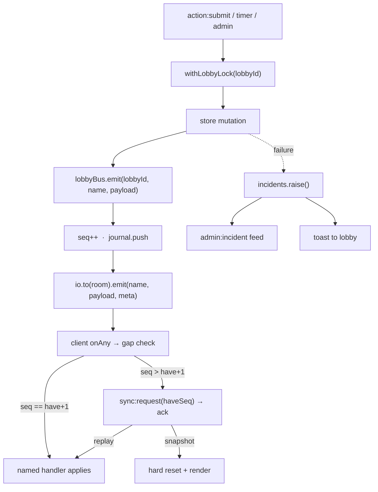

# Remediation Design — Reliable Event Propagation for StoryTeller

**Scope:** the smallest coherent architecture satisfying all five operator requirements. Grounded in files read this session; every line reference verified against the working tree at `Refactor@634b6c1`.

**Discovered project values** (currently `_unset_` in `CLAUDE.md` → Project Overrides; record them there in the first commit):

| Key | Value |
|---|---|
| `TEST_CMD` (unit) | `npm test` → `node --test server/` |
| `TEST_CMD_INTEGRATION` | `npm run test:integration` → `node --test server/test-integration/` |
| `COVERAGE_CMD` | `npm run coverage` |
| `TYPECHECK_CMD` | none configured (no TS, no `checkJs`) — state this explicitly in every completion report |
| `LINT_CMD` | none configured |
| `MODULE_ROOT` | `server/services/`, `server/routes/` (server); `client/` (flat, classic scripts) |

---

## 0. Design thesis

Five requirements, but they collapse to **one missing primitive**: there is no name for "the state of lobby X at a point in time." Every bug in the audit is a consequence — a client cannot tell it missed something, the server cannot tell a client is behind, and neither can name what to resend.

The whole design is therefore: **give each lobby a monotonic sequence number, put every state-bearing broadcast through one choke point that stamps it, keep the last N stamped events, and give identity a name that outlives `socket.id`.** Everything else (self-healing, escalation, admin repair) hangs off those two facts.

Two new concepts, five new files:



**Non-goal:** an ack-per-packet delivery guarantee. Socket.IO over a live TCP connection does not drop packets in order; the observed losses are *room-membership* losses and *disconnect-window* losses. A sequence number plus a bounded journal covers both at a fraction of the cost.

---

## 1. Sequencing, journal, and the resync protocol

### 1.1 New file: `server/services/lobbyBus.js`

The single writer for every lobby-room broadcast. Replaces ~90 scattered `io.to(room(lobbyId)).emit(...)` / `io.to(lobbyId).emit(...)` call sites.

```js
/**
 * @description Per-lobby monotonic sequencer + bounded replay journal. Every
 *   state-bearing broadcast to a lobby room passes through emit() so that a
 *   client can detect a gap and request exactly what it missed.
 * @param {object} deps - { io, room, incidents }
 * @returns {{emit, emitVolatile, seqOf, sliceSince, dropLobby, JOURNAL_DEPTH}}
 */
export function createLobbyBus({ io, room, incidents }) { … }
```

State: `Map<lobbyId, { seq: number, ring: Entry[], head: number }>`. `JOURNAL_DEPTH = 256`. **Never persisted** — a restart resets `seq` to 0 and forces every client into snapshot mode, which is the correct behaviour (see §1.5, `epoch`).

Two methods, and the split matters:

| | `emit(lobbyId, name, payload)` | `emitVolatile(lobbyId, name, payload)` |
|---|---|---|
| Gets a `seq` | yes | no |
| Journaled | yes | no |
| Replayed | yes | never |
| Client gap-checks it | yes | ignored |

**`emitVolatile` list** (media/ephemera — replaying these is worse than losing them):
`narration:start`, `narration:audio`, `narration:audio:end`, `sfx:play`, `dice:result`, `toast`, `debug:llm`.
`music:change` is volatile too — it is recoverable from `state.currentMusic`, which `client/sockets.js:78-83` already re-requests on every `state:update`.

Everything else is sequenced. Critically that includes `state:update` itself (from `sendState`, `server/routes/turnTimer.js:497-501`) — sequencing the snapshot from the *same counter* as the deltas is what makes §4's watermark rule work and is what kills the existing "`state:update` clobbers a newer `hp:update`" race noted in the emit-surface area notes.

### 1.2 Wire shape — server → client

Envelope is a **third emit argument**, not a payload field. Socket.IO passes extra args through untouched, and existing handlers written as `socket.on("turn:update", ({current, order}) => …)` (`client/sockets.js:104`) ignore it. This makes Phase 2 a pure addition with zero handler edits.

```js
io.to(room(lobbyId)).emit(name, payload, meta);
```

```jsonc
// meta — present on every sequenced lobby broadcast, absent on volatile/global
{
  "lid":   "a1b2c3",   // lobbyId — lets the client (and admin panel) drop cross-lobby traffic
  "seq":   1417,       // monotonic, starts at 1, +1 per sequenced emit for this lobby
  "epoch": 1737936000, // process boot time (ms). Change ⇒ counter reset ⇒ snapshot required
  "ts":    1737936104512
}
```

`epoch` is what stops a server restart from silently looking like "seq went backwards": the client compares `epoch` first and takes a snapshot on any change. This is the fix for the finding that a `nodemon` reload orphans every connected client at once.

### 1.3 Wire shape — client → server (`sync:request`)

Uses a Socket.IO **ack callback**, not a reply event. That gives request/response correlation and a client-side timeout for free, and keeps the resync payload off the `onAny` path (so replayed events cannot re-trigger gap detection — see §4).

```js
socket.emit("sync:request", { lobbyId, haveSeq, haveEpoch }, (res) => { … });
```

Server handler (new `server/routes/syncEvents.js`, registered in the `io.on("connection")` block at `server/server.js:241-256` alongside `registerChatEvents` / `registerAdminEvents`):

```jsonc
// A — incremental replay (haveEpoch matches, gap within journal depth)
{
  "mode": "replay",
  "epoch": 1737936000,
  "fromSeq": 1402, "toSeq": 1417,
  "events": [
    { "name": "hp:update",   "payload": { "player": "Kara", "hp": 13, "delta": -5, "reason": "" },
      "meta": { "lid": "a1b2c3", "seq": 1402, "epoch": 1737936000, "ts": 1737936101002 } }
  ]
}

// B — full snapshot (haveSeq 0, epoch mismatch, gap older than the journal, or 3 failed replays)
{
  "mode": "snapshot",
  "epoch": 1737936000,
  "seq": 1417,          // seq at the instant publicState() was built — the watermark
  "state": { /* store.publicState(lobbyId) */ }
}

// C — refusal
{ "mode": "denied", "reason": "not_a_member" }   // store.belongs(lobbyId, socket.id) === false
```

**Snapshot atomicity.** `seq` and `state` must be captured with no `await` between them — `publicState()` (`lobbyStore.js:156-216`) is synchronous, so `{ seq: bus.seqOf(lobbyId), state: store.publicState(lobbyId) }` in one expression is atomic w.r.t. the event loop. This is the invariant that makes §4's discard rule sound: any event still in flight when the ack is written necessarily has `seq ≤ snapshot.seq`.

**Rate limit:** one `sync:request` per socket per 250 ms, 20 per minute. Excess → `{mode:"denied", reason:"rate_limited"}` and an `incidents.raise(… SYNC_STORM …)`. Without this, a systematic client bug becomes a self-DoS.

### 1.4 Client gap detection (new file `client/session.js`)

```js
// installed once, before registerSocketEvents()
socket.onAny((name, payload, meta) => {
    if (!meta || !meta.seq) return;              // volatile / global — pass through
    if (meta.lid !== lobbyId) return;            // wrong lobby (also fixes admin room accumulation)
    if (meta.epoch !== syncEpoch) return scheduleResync("epoch");
    if (meta.seq <= syncSeq) return;             // already applied; handler will double-apply — see §3
    if (meta.seq === syncSeq + 1) { syncSeq = meta.seq; return; }
    // gap
    setSyncState("resyncing");
    scheduleResync("gap", { from: syncSeq + 1, to: meta.seq - 1 });
});
```

`onAny` listeners fire **before** named listeners in socket.io-client (`Socket#emitEvent` walks `_anyListeners` then `super.emit`), so the watermark is current by the time a handler runs. `scheduleResync` is debounced 150 ms so a burst of five missed events yields one request.

Note the deliberate choice on the gap branch: the named handler **still runs**. Suppressing it would require touching all ~45 handlers in `client/sockets.js`. Instead we accept a transient over-apply and let the snapshot/replay that lands ~1 RTT later be authoritative. That is only safe once §3's idempotency work is done — hence the phase ordering.

### 1.5 Sizing

256 entries ≈ 8–15 turns of history. At an observed ~18 sequenced events per turn, that is a ~14-turn replay window — comfortably longer than any transient disconnect, and short enough that memory is bounded at roughly 256 × ~2 KB ≈ 512 KB per active lobby worst case (the largest sequenced payload is `state:update`, which carries full `history`).

**Journal memory guard:** if a single `state:update` payload exceeds 256 KB, journal a `{ name, meta, oversize: true }` tombstone instead. A tombstone in the replay range forces `mode:"snapshot"`. This prevents a long campaign's history from turning the journal into a memory leak.

---

## 2. Reconnect identity

### 2.1 Is `connectionStateRecovery` the right tool? — Partly. Necessary, not sufficient.

Enable it at `server/server.js:78`:

```js
const io = new Server(server, {
    cors: { origin: "*" },
    connectionStateRecovery: { maxDisconnectionDuration: 2 * 60 * 1000, skipMiddlewares: false },
});
```

**Why it helps enormously here:** every authority check in this codebase is keyed on `socket.id` — `isHost` (`lobbyPlayers.js:76-79`), `belongs` (`:97-100`), `playerBySid` (`:211-216`), and `lobby.sockets[socket.id]`. Recovery restores `socket.id` *and* `socket.rooms`, so a successful recovery repairs the room membership, the registry lookup, and host authority simultaneously with a one-line change. Nothing else in the audit has that leverage-to-diff ratio.

**Why it cannot be the only mechanism — four independent reasons:**

1. **It restores the transport, not the domain teardown.** `server.js:1042-1056` already ran on `disconnecting`: `players[name].disconnected = true`, `cancelTurnTimer`, `removeFromTurnOrder`, and a room-wide `player:left` + `turn:update`. Recovery hands back a socket in the right room but the player is *gone from initiative* and the rest of the party has been told so. This is the single most important reason: recovery is a transport feature and this is a domain-state bug.
2. **It cannot survive a page reload.** A reload is a brand-new browser session with no recovery handle. Reload is also the operator's current recovery instruction, so it must work.
3. **It is best-effort.** It fails past `maxDisconnectionDuration`, and it fails across a server restart (the recovery session lives in the in-memory adapter) — which is precisely the "nodemon/deploy orphans everyone" case.
4. **It is defeated by our own code.** `client/init.js:4` calls `socket.disconnect()` unconditionally on `beforeunload`, which sets `skipReconnect` and permanently kills the manager. Recovery never gets a chance.

**Verdict: both.** `connectionStateRecovery` as the fast path, and an app-level session token as the authoritative rebinding. When recovery succeeds, `socket.recovered === true` and the resume handshake becomes a no-op that only re-emits `sync:request`.

### 2.2 Durable identity

Three changes:

**(a) `clientId` becomes durable.** `client/app.js:46-48` is `Math.random().toString(36).slice(2,10)` at module scope — regenerated every page load, which is why the `clientId` written to `lobby.sockets[socket.id]` at `server.js:428` is useless for re-association.

```js
// client/session.js
const clientId = localStorage.getItem("st.clientId")
    || (() => { const v = crypto.randomUUID(); localStorage.setItem("st.clientId", v); return v; })();
```

**(b) New durable map `lobby.clients`,** replacing `lobby.sockets` as the source of truth for identity:

```jsonc
"clients": {
  "3f9c…-uuid": {
    "playerName":  "Kara",
    "characterId": "8d21…",
    "role":        "player",        // "player" | "chat" | "viewer"
    "token":       "<opaque 32-byte hex>",   // never logged (STY-3)
    "lastSid":     "AbC123…",
    "lastSeenAt":  1737936104512
  }
}
```

`lobby.sockets` survives as a **volatile** `sid → clientId` index only. It is stripped in `persist()` (§5c) and rebuilt from live connections. `hostSid` is demoted to a derived cache; `hostCharacterId` (already persisted, `lobbyPlayers.js:154-156`) becomes the durable host identity, and `isHost` resolves `socket.id → clientId → characterId === hostCharacterId`.

This single change fixes `socket-id-is-the-only-identity`, `persisted-socket-map-and-hostsid-survive-restart`, and gives `chat-popup-second-socket-registers-as-the-player` a clean answer: the chat popup resumes with `role:"chat"`, and `allReady`, `publicState().connected`, `getActivePlayerNames`, and the `disconnecting` teardown all skip non-`"player"` roles.

**(c) The resume handshake.** New `server/routes/sessionEvents.js` (mirrors the `registerChatEvents` / `registerAdminEvents` pattern, which makes it unit-testable with a stub socket — §8):

```js
socket.emit("session:resume",
    { lobbyId, clientId, token, haveSeq, haveEpoch, role: "player" },
    (res) => { … });
```

Server, in order:
1. `lobby.clients[clientId]` exists and `token` matches (timing-safe compare) → else `{ok:false, reason:"unknown_session"}`, client falls back to the existing `join:rejoin` flow.
2. **Cancel the departure grace timer** for this `clientId` (§2.3) — this is the step that prevents the teardown.
3. `socket.join(room(lobbyId))`.
4. Re-key: delete any `lobby.sockets[oldSid]` whose value is this `clientId`; set `lobby.sockets[socket.id] = clientId`; `clients[clientId].lastSid = socket.id`.
5. If `role === "player"`: `delete players[name].disconnected`; **`if (!initiative.includes(name)) insertIntoInitiative(...)`** — the guard is mandatory, because `lobbyCombat.js:197-224` removes-then-reinserts (line 202) but bumps `turnIndex` unconditionally at :218-219, so a second call double-bumps and silently skips a player.
6. If `characterId === lobby.hostCharacterId`: refresh the derived `hostSid`.
7. Reply with the same union as `sync:request` (`replay` | `snapshot`), so resume and gap-recovery share one code path and one client applier.
8. Broadcast `player:returned` through the bus *only if* the grace timer had not yet fired (i.e. nobody was told they left).

Client wiring (`client/session.js`), replacing the sole `connect` handler at `client/sockets.js:726-729`:

```js
socket.on("connect", () => {
    socket.emit("lobbies:watch");
    if (lobbyId && sessionToken) resume();      // idempotent, safe on first connect too
    setSyncState("live");
});
socket.on("disconnect",     (r) => setSyncState(r === "io server disconnect" ? "kicked" : "resyncing"));
socket.on("connect_error",  ()  => setSyncState("offline"));
socket.io.on("reconnect_failed", () => setSyncState("offline"));
```

And `client/init.js:2-15` — move teardown off `beforeunload`:

```js
window.addEventListener("pagehide", (e) => { if (!e.persisted && lobbyId) socket.disconnect(); });
window.addEventListener("beforeunload", (e) => {
    if (lobbyId && me?.name && currentState?.phase === "running") { e.preventDefault(); e.returnValue = ""; }
});
```

`socket.disconnect()` no longer runs on the "Stay" path, and no longer runs at all for waiting-phase lobbies — closing `beforeunload-disconnects-before-the-stay-prompt`.

### 2.3 Departure grace timer

`server.js:1017-1071` (`disconnecting`) is rewritten so the destructive half is deferred:

```
disconnecting:
  rec = lobby.sockets[socket.id]  →  clientId  →  clients[clientId]
  if role !== "player":  delete sockets[sid]; return           // chat/viewer never tears down a player
  players[name].disconnected = true                            // cheap, reversible, in publicState
  bus.emit(lobbyId, "party:update", buildPartySnapshot())       // party shows "away", not gone
  pendingDeparture.set(clientId, setTimeout(finalizeDeparture, GRACE_MS))   // GRACE_MS = 45_000
```

`finalizeDeparture` holds the *existing* body of `server.js:1046-1065` — `cancelTurnTimer` if theirs, `removeFromTurnOrder`, `player:left`, `resolveActiveTurn` + `turn:update`, hibernate-if-last. `session:resume` clears the timer; nothing is ever undone because nothing was ever done.

`GRACE_MS = 45_000` is chosen to exceed engine.io's worst case (`pingInterval 25s + pingTimeout 20s`), so a hard link drop that takes the full ping timeout to detect still lands inside the window when the client reconnects promptly.

**Why 45 s of a stalled turn is acceptable:** the turn timer keeps running underneath, so an actually-departed player is skipped by `handleTimerExpiry` on the normal schedule. The grace period delays the *roster* update, not the game.

---

## 3. Idempotency — required before any replay is safe

Replay is only sound for events whose application is a **function of the payload**, not of prior client state. Audit of every sequenced event:

### 3.1 Already idempotent — replay-safe as-is

`state:update`, `party:update`, `turn:update`, `map:update`, `suggestions:update`, `rest:vote:update`, `timer:cancel`, `spellslots:update`, and the four resource deltas — because they all carry the **absolute post-value**: `hp:update` sends `hp` (`gameUpdates.js:73-78`), `xp:update` sends `xp` (`:30-35`), `gold:update` sends `gold` (`:151-155`), `inventory:update` sends `newCount` (`:117-124`), `conditions:update` sends the full array (`:181-184`). The client assigns rather than accumulates (`client/sockets.js:460-462`, `:420`, `:494`, `:579`). Verified — this is a genuine strength of the existing design and is why the journal approach is viable at all.

Their **log lines** are not idempotent (`appendActionLog` at `sockets.js:399/457/490/576` would duplicate). Fix once, centrally: `appendActionLog(text, seq)` stamps `data-seq` and returns early if `[data-seq="N"]` already exists.

### 3.2 Must be fixed — with the finding each fix closes

| Event | Why non-idempotent | Fix | Closes |
|---|---|---|---|
| `narration` | appends to `#storyLog`; replay duplicates prose | add `historyIndex` to the payload (`server.js:878`, from `store.appendDM`'s return); client stamps `div.dataset.historyIndex`; `renderLogs` (`app.js:668-730`) skips any index already in the DOM instead of trusting `renderedHistoryCount` | `storylog-history-double-render` (the existing *double render on every turn*), `rendered-history-count-never-reset` |
| `action:log` | same | same — `historyIndex` from `appendUser` (`server.js:921`, `turnTimer.js:318`) | `storylog-history-double-render` |
| `player:levelup` | offer → client confirm → **unconditional grant** (`server.js:617-618`); a replayed or duplicated offer stacks modals whose hardcoded `id="confirmLevelUp"` (`sockets.js:280-309`) binds a second listener to the *first* modal's button, so one click emits twice | server mints `p.pendingLevelUp = { token, toLevel }`, includes it in `publicState`, and `player:levelup:confirm` must present the token; handler **clears the token before applying** and rejects a mismatch. Client renders the prompt from state, not from a one-shot emit. Also validate `gains` server-side against a 2-point budget and an attribute allowlist (`lobbyProgression.js:60-63` currently adds any key already in `stats`, including `hp`/`max_hp`) | `levelup-confirm-is-not-idempotent`, `levelup-delta-only-unicast`, `levelup-targets-stale-sid-and-skips-state-broadcast` |
| `player:death` | plays SFX + opens a modal | guard on `currentState.players[p]?.dead` before the side effects (the state write stays unconditional); also fix `sockets.js:152` `#actionButton` → `els.sendAction` (element does not exist; the TypeError aborts the handler) and the same string in the `showDeathModal` selector at `app.js:852` | `player-death-null-element-throws` |
| `dice:result`, `sfx:play`, `music:change`, `toast`, `debug:llm` | side-effectful media | `emitVolatile` — never journaled, never replayed. Music recovers from `state.currentMusic` | — |
| `narration:done` *(inbound)* | first-ack-wins, unauthenticated, uncorrelated (`server.js:1008-1014`) | require `store.belongs`, require `streamId`, per-client ack set — §5b | `narration-done-unauthenticated-first-wins`, `first-client-narration-done-ends-everyones-wait`, `narration-disabled-client-forces-premature-timer-start`, `unknown-streamid-audio-silently-dropped-and-acks-done` |
| `insertIntoInitiative` *(server, on resume)* | `lobbyCombat.js:218-219` bumps `turnIndex` on every call, including for an already-present player | membership guard at the call site (§2.2 step 5) and inside the method | `reconnect-*` family |
| `store.appendUser` / `appendDM` | inherently order-dependent | not replayed (server-internal); protected by the per-lobby lock, §5h | `no-inflight-guard-on-action-submit` |

### 3.3 The one thing replay must never touch

`ui:lock` / `ui:unlock` are currently transient with no state (`ui-lock-has-no-server-state`). Do **not** journal them. Instead make the lock a *field*: `lobby.uiLock = { actor, message, startedAt } | null`, set/cleared where the events are emitted today (`server.js:767/773/803/831/883/902/910`, `turnTimer.js:145/187/321/381/411/421/487`), included in `publicState`, and applied by the client's `state:update` handler. A snapshot then reconstructs the overlay correctly in both directions — a mid-lock joiner gets locked, and a reconnecting client behind a stale overlay gets unlocked. Replay becomes unnecessary because state carries it.

---

## 4. Client reconciliation — delta vs. snapshot

### 4.1 The three-line rule

```
apply(event) ⟺ meta.epoch === syncEpoch  ∧  meta.seq > syncSeq
```

Everything follows:

- **Normal delta** (`seq === syncSeq + 1`) → apply, advance watermark.
- **Duplicate / late** (`seq ≤ syncSeq`) → discard. This is the entire anti-clobber mechanism.
- **Gap** (`seq > syncSeq + 1`) → apply anyway (it *is* newer), flag `resyncing`, request the missing range.

### 4.2 Why snapshot and delta can no longer clobber each other

The bug today is that `state:update` at `server.js:901` is emitted 10–60 s *after* the `hp:update`/`party:update` deltas it supersedes (the awaited `streamNarrationToClients` at `:879` sits between them), and the client at `sockets.js:50-51` assigns `currentState = state` unconditionally. Any delta that arrived during the narration window is silently reverted.

Under the watermark that becomes impossible, because both go through the same counter:

- `hp:update` gets seq 1402. Snapshot built at seq 1417 already contains that HP. Client at seq 1417 discards a re-delivered 1402. ✔
- A snapshot from a `sync:request` issued *before* seq 1418 was emitted carries `seq: 1417`; event 1418 arriving after is `> 1417`, so it applies on top. ✔
- The reverse — an old snapshot landing after newer deltas — is discarded, because `snapshot.seq ≤ syncSeq`. ✔ (This is the case that breaks today.)

The same rule fixes `two-party-shapes-diverge` mechanically, but the underlying duplication must also go: extract `buildPartySnapshot(lobby)` from `gameUpdates.js:201-221` and have `publicState().party` (`lobbyStore.js:161-171`) call it. Two implementations of "what is a party member" cannot be kept in sync by any protocol.

### 4.3 When to take a full snapshot

| Trigger | Mode |
|---|---|
| `haveSeq === 0` (fresh join, first `state:request`) | snapshot |
| `meta.epoch !== syncEpoch` (server restarted) | snapshot |
| `haveSeq < journal.oldestSeq` (gap older than 256 events) | snapshot |
| oversize tombstone inside the replay range | snapshot |
| 3 consecutive replay failures | snapshot, then `degraded` if it also fails |
| everything else | replay |

### 4.4 Applying a replay without re-registering handlers

The replay applier must reach the same ~45 handlers registered in `registerSocketEvents` (`client/sockets.js`) without going through `onAny` (which would re-trigger gap detection):

```js
function applyReplay(events) {
    for (const e of events) {
        for (const fn of socket.listeners(e.name)) fn(e.payload, e.meta);
        syncSeq = e.meta.seq;
    }
}
```

`socket.listeners(name)` is standard on the socket.io-client emitter. Zero handler changes, zero duplication of application logic. This is the payoff for choosing the third-argument envelope in §1.2.

**Snapshot application is a hard reset** — it must clear the DOM the deltas wrote:

```js
function applySnapshot(seq, state) {
    renderedHistoryCount = 0;
    els.storyLog.innerHTML = "";      // nothing in client/ does this today
    currentState = state;
    syncSeq = seq;
    // existing state:update body: drawPartyComponent / drawEnemyRoster / renderState / renderLogs / updateGameUI
}
```

Also call `applySnapshot(0, …)` from `player:kicked` (`sockets.js:122-128`) and `lobby:closed` (`:735-739`) — that alone closes `rendered-history-count-never-reset`, including the stale-pin-button hazard where a lobby-A pin button emits `story:pin {lobbyId: B, historyIndex: <A's index>}`.

---

## 5. Self-healing

New file `server/services/incidents.js` backs all of this: `raise(lobbyId, {code, severity, message, detail})` → bounded per-lobby ring (128) → `admin:incident` to the admin room → `toast` to the lobby room when `severity >= "warn"`.

### a. Player-not-found on an update — resolve, then escalate

`gameUpdates.js:26, 69, 113, 147, 177` all do `if (!key) { console.warn(...); continue; }` — five silent drops that let narration describe damage the store never recorded.

Replace `findPlayerKey` (`lobbyPlayers.js:235-242`) with a laddered resolver:

1. exact key hit;
2. **normalize both sides** — the current normalization is one-sided (`normalizeName` is applied to LLM output only, while `upsertPlayer` stores the raw client name), so `"Bob_Smith"` is unmatchable *even on a verbatim echo*. Normalizing stored keys too is a pure win;
3. casefold + strip punctuation/diacritics;
4. first-token / unique-prefix match against `Object.keys(s.players)` (catches `"Gandalf the Grey"` → `"Gandalf"`);
5. still nothing → `incidents.raise(lobbyId, {code:"PLAYER_NOT_FOUND", severity:"warn", detail:{requested, candidates}})`. **Never a bare `continue`.**

Longer term, `lobbyPrompts.js:83-101` should require the model to echo the exact party-block key, and the whole `updates` object should be validated at the boundary (CQ-6) rather than applied entry-by-entry.

### b. Stalled narration handshake

Replace the single-entry `pendingTimerStarts` (`turnTimer.js:49, 64-81`) with a per-stream wait record:

```js
narrationWaits: Map<lobbyId, { streamId, expected: Set<clientId>, acked: Set<clientId>, deadline }>
```

- `expected` = connected `role:"player"` clients at the moment the stream *ends* (populated in `scheduleTimerAfterNarration`, which already runs after the await).
- `narration:done {lobbyId, streamId}` → reject if `!store.belongs`, reject if `streamId !== current`, else `acked.add(clientId)`.
- Start the timer when `acked ⊇ expected` **or** at `deadline` (45 s, down from the current 3 min), whichever first.
- **Auto-heal:** on any disconnect, drop the departed `clientId` from `expected` and re-evaluate — otherwise one departed listener holds the whole table for the full deadline.
- **Opt-out, not fake-ack:** `client/sockets.js:249-253` currently dispatches `narration:playback:ended` when `narrationEnabled === "false"`, which makes a muted player's client end the reading delay for everyone. Send `narration:optout {streamId}` instead; the server removes them from `expected` rather than counting them as finished.
- `cancelTurnTimer` (`turnTimer.js:238-244`) must clear `narrationWaits` too — today it clears only `activeTimers`, leaving an orphaned fallback that later fires `timer:cancel` + a fresh full-duration `timer:start` into an unrelated turn.
- Missing the deadline → `incidents.raise(… NARRATION_TIMEOUT, detail:{ missing: [...expected].filter(x => !acked.has(x)) })`.

### c. Orphaned socket records

- `persist()` (`lobbyStore.js:74-78`) serializes a sanitized copy: `const { sockets, hostSid, ...durable } = s;` and writes `{ ...durable, sockets: {} }`, stripping every `_`-prefixed key in the same replacer — which also fixes `summarizing-lock-persisted-to-disk` (two lobbies on disk today have `"_summarizing": true` baked in, permanently disabling summarization) and the transient `lastServerOutcome` scratch.
- `rehydrate()` (`:47-54`) forces `s.sockets = {}` after parse, wraps each file in try/catch (matching what `syncMetaFromDisk` at `:71` already does), **logs the offending filename**, and renames it to `<id>.json.corrupt` rather than aborting boot. Today one unparseable file throws out of `new LobbyStore()` at `server.js:79` before `server.listen`, and `docker-compose.yml`'s `restart: unless-stopped` turns that into a crash-loop.
- `persist()` becomes atomic: write `${lobbyId}.json.tmp` → `fsync` → `renameSync`.
- `reapOrphanSockets(lobbyId)` on resume, on `getPublicLobbies()`, and on a 60 s interval.

### d. UI-lock watchdog

With `lobby.uiLock` persisted (§3.3), a sweep clears any lock older than `LLM_TIMEOUT_MS + 30_000`, emits `ui:unlock` through the bus, and raises `LOCK_WATCHDOG_FIRED`.

### e. TTS deadline

`streamNarrationToClients` (`ttsService.js:190-296`) has no timeout on the fetch and no completion deadline; the awaiting promise resolves only from `nodeStream.on("end")` and rejects only from `on("error")`, so a half-open body never settles. Every caller awaits it before releasing state — `server.js:713/787/879`, `turnTimer.js:180/368/477` — so a single upstream stall freezes the lobby's turn loop with no server-side recovery.

Fix: `AbortController` + `signal` on the fetch, `Promise.race` against a 90 s total / 30 s idle-data watchdog (reset on each `data` event). On abort: emit `narration:audio:end {aborted:true}`, raise `TTS_ABORT`, and continue. Independently, wrap every `await streamNarrationToClients(...)` in `try/finally` so `ui:unlock` / `turn:update` / `state:update` / `scheduleTimerAfterNarration` always run.

### f. Turn-order invariant

`assertTurnInvariant(lobbyId)` after every initiative mutation: every name in `initiative` exists in `players`, is not `dead`, and `turnIndex < initiative.length`. Auto-repair by filter + clamp; raise `TURN_INVARIANT_REPAIRED` when it had to. Catches the `player:kick` leak (`server.js:394-405` deletes the player but never calls `removeFromTurnOrder`) and `rename-orphans-initiative-and-characterid`.

Also fix the latent field mismatch: `validateAction` tests `actor.sheet?.dead` (`lobbyCombat.js:93`) while `markPlayerDead` writes `players[key].dead` (`:249`). The dead check never fires. Change the read to `actor.dead`.

### g. Turn epoch — kills every double-advance

Add `s.turnEpoch`, incremented by `nextTurn`, `removeFromTurnOrder`, and `insertIntoInitiative`. Then:

```js
store.nextTurn(lobbyId, { expectEpoch })   // no-op if s.turnEpoch !== expectEpoch
```

The action pipeline captures `expectEpoch` at validation (`server.js:769`) and passes it at `:895`. A death inside `broadcastHPUpdates` (`gameUpdates.js:80-90`) already vacated the slot and bumped the epoch, so the second advance is skipped — and `gameUpdates.js:89` stops emitting `turn:update` at all, leaving exactly one authoritative emit per pipeline.

Closes `duplicate-contradictory-turn-update-on-death`, `death-advances-turn-twice`, `death-during-own-turn-double-advances`, `timer-expiry-races-action-submit`, `disconnect-during-action-await-double-advances-and-orphans-roll`.

### h. Per-lobby serialization

`withLobbyLock(lobbyId, fn)` — a `Map<lobbyId, Promise>` chain, released in `finally`. Wraps `action:submit` (`server.js:746`), `handleTimerExpiry` (`turnTimer.js:294`), `handleRestResolved` (`:401`), `dice:roll` (`server.js:915`), `player:join:game` (`:459`). A second `action:submit` while one is in flight gets `action:rejected {reason:"resolving"}` — never a silent second pipeline.

Two ordering fixes inside `action:submit` that the lock does not cover:

- Move `cancelTurnTimer` / `resetMissedTurns` / `ui:lock` (`:765-767`) **below** `validateAction` (`:769`), and re-arm the timer on the rejection path. Today one rejected submit destroys the *active* player's timer permanently. (`rejected-action-cancels-timer-and-broadcasts-global-unlock`, `hide-death-modal-mass-enable`)
- `rest:propose` (`:352-381`) must `cancelTurnTimer` on vote start and re-arm in `handleRestResolved`. (`rest-propose-does-not-cancel-turn-timer`)
- The `roll:required` branch (`:881-892`) must arm a roll deadline before returning. (`roll-required-stalls-the-turn`)

### i. Unhandled rejection guard

`server.js:923-931` fires `getLLMResponse(...).then(async …)` with no `.catch()`, and there is no `process.on("unhandledRejection")` anywhere in `server/` — on Node ≥ 15 that terminates the process and drops every client. Add the `.catch()` **and** a process-level handler that raises `PROCESS_UNHANDLED_REJECTION` before deciding whether to exit.

---

## 6. Escalation

### 6.1 Player-facing — one indicator, five states

A single `#syncIndicator` pill in the game header. There is currently **no** `disconnect` / `connect_error` handler anywhere in the game client, so an offline player sees a fully live UI.

| `syncState` | Display | Behaviour |
|---|---|---|
| `live` | hidden | — |
| `resyncing` | amber "Reconnecting…" | set on `disconnect` and on gap detection; auto-clears on successful resume/replay |
| `offline` | red "Disconnected — **Reconnect**" | `connect_error` / `reconnect_failed`; button calls `socket.connect()` then `resume()` |
| `degraded` | amber "Some updates were missed — **Refresh**" | 3 failed replays; forces a snapshot request; also fires a `client:incident` |
| `kicked` | red "Removed from the game" | `disconnect` reason `"io server disconnect"` — will not auto-recover (`kickPlayerForInactivity`, `turnTimer.js:274-277`). Today the only signal is a `toast` that auto-dismisses after 4000 ms (`app.js:92`) |

Plus the missing guard on outbound emits — `handleSendAction` (`eventHandlers.js:239-247`) and the dice/equip handlers currently buffer into a dead socket's `sendBuffer` with no feedback:

```js
if (!socket.connected) { showToast("Not connected — your action was not sent.", "danger"); return; }
```

### 6.2 Admin-facing — incident feed

Incident codes: `PLAYER_NOT_FOUND`, `NARRATION_TIMEOUT`, `TTS_ABORT`, `LLM_ERROR`, `LLM_PARSE_FAIL`, `SEQ_GAP`, `REPLAY_FAILED`, `SYNC_STORM`, `TURN_INVARIANT_REPAIRED`, `LOCK_WATCHDOG_FIRED`, `PERSIST_FAIL`, `LOBBY_QUARANTINED`, `PROCESS_UNHANDLED_REJECTION`, `CLIENT_EXCEPTION`.

Wire the currently-silent sites into it: `llmService.js:155-158` and `:199-202` (which today **return the error string as DM prose**, and `server.js:876` appends it to `lobby.history`, poisoning every future prompt — the raise must happen *and* the string must not be appended); `server.js:868` (parse failure); the five `gameUpdates.js` warns; `ttsService.js:297`; `sfxService.js:198`.

`client/errorLog.js` becomes a sender: `_pushEntry` debounce-flushes to a new `client:incident` socket event carrying `{lobbyId, clientId, playerName, entries}` → `CLIENT_EXCEPTION`. Today the buffer is write-only with no UI trigger and the admin page does not even load the script (`admin.html:812-813`).

Admin panel changes, all in `client/admin/admin.js`:
- **Replace the no-op at `:338-340`** (`socket.on("state:update", () => {/* comes through admin:update */})` — the comment is false; `admin:update` is emitted from only three admin-initiated sites, `adminEvents.js:362/386/450`). Factor the `admin:update` body at `:264-271` into `applyState(state)` and call it from `admin:connected`, `admin:update`, **and** `state:update`, gated on `meta.lid === currentLobby`. This one change fixes `admin-panel-has-no-live-state-feed`, `admin-cannot-see-connection-state`, and the stale-roster half of `admin-mutation-on-missing-player-broadcasts-zero`.
- Add an **Incidents** tab + an unacknowledged-incident badge.
- Add a **Conn** column from `state.connected` × `!p.disconnected`, greying disconnected rows.
- `admin:connect` must `socket.leave(room(prev))` before joining a different lobby (`adminEvents.js:167-182`).
- Fix `refreshPlayerCell` (`:623-634`) writing bare `hp` into a cell rendered as `${hp}/${maxHp}` (`:184`).
- Replace inline `onclick="kickPlayer('${esc(p.name)}')"` (`:188-189`) with `data-player` + `addEventListener`. `esc()` (`:769-773`) escapes `<`/`>` but not quotes, so `Kael'thas` makes the attribute uncompilable at render time (button silently inert) and a `"` in a name is an attribute-injection sink in an authenticated panel.

---

## 7. Admin manual-repair surface

Every operation is a new `admin:event` case in `server/routes/adminEvents.js`, and **every one takes an ack callback** returning `{ok, error}` — the current handlers bare-`return` on failure (`:189`, `:321`, `:343`) or broadcast success unconditionally (`:334`, after an emit that was skipped at `:331`).

**Resolve the target once, at the top of the switch:**

```js
const key = store.findPlayerKey(lobbyId, payload.player);
if (!key) return ack({ ok: false, error: `Player "${payload.player}" is not in lobby ${code}` });
```

— then pass `key` (never `payload.player`) into every store call and emit. Also change the store setters to return `null` rather than `0`/`[]` on a miss so the sentinel is unambiguous (`lobbyProgression.js:78, 113, 132, 171, 190`).

| Operation | Payload | Closes |
|---|---|---|
| `player:revive` | `{player, hp}` — clears `dead`, hp ≥ 1, re-inserts into initiative, broadcasts party + state | `death-and-turn-order-are-one-way-no-revive` (`dead` is currently write-once with **zero** clearing code paths server-wide) |
| `turn:setCurrent` | `{player}` — sets `turnIndex` by name, bumps `turnEpoch` | admin can only advance blindly today |
| `initiative:rebuild` / `:insert` / `:remove` | `{}` / `{player, index}` / `{player}` | `rename-orphans-initiative-and-characterid`, kick leak |
| `timer:cancel` / `:restart` / `:extend` | `{}` / `{minutes}` / `{seconds}` | `admin-phase-is-a-raw-setter`, `orphaned-pending-fallback-resets-running-timer` |
| `ui:unlock:force` | `{}` — clears persisted `lobby.uiLock` | `ui-lock-has-no-server-state` |
| `narration:force-complete` | `{}` — resolves a stuck `narrationWaits` entry | `tts-stream-has-no-timeout-and-blocks-whole-turn` |
| `player:setField` | `{player, field, value}` for `level`, `max_hp`, `stats.*`, `xp`, `gold`, `class`, `race`, `abilities`, `disconnected` — absolute, allowlisted | `upsert-player-wipes-inventory-and-stats` recovery |
| `player:levelup:grant` | `{player, gains}` — applies server-side, bypassing the client round-trip | `levelup-delta-only-unicast` |
| `history:edit` / `history:delete` | `{index, text}` / `{index}` | LLM error strings poisoning `lobby.history` |
| `enemy:set` / `enemy:remove` | `{name, hp, status}` / `{name}` | enemies are unrepairable and only visible in Raw JSON |
| `state:resync` | `{player?}` — forces a snapshot push to one or all clients | universal escape hatch |
| `lobby:setPhase` | validated against `["waiting","characterCreation","readyCheck","running","hibernating","wiped","completed"]`; `→ running` calls `startGame` when `initiative` is empty and re-arms the timer | `admin-phase-is-a-raw-setter` (raw unvalidated string write today) |
| `lobby:repair` | `{}` — runs every §5 invariant check, returns the list of what it fixed | catch-all |

---

## 8. Phased implementation plan

Ordered so the highest-severity desync is fixed first. Each phase ≤ 5 interdependent files, ends green with tests + docs + a commit (GIT-2, GIT-3). Server tests use dependency injection with stub `io`/`socket` objects — which the codebase already supports (`gameUpdates.js` takes `io` as a parameter; `createTimerSystem` takes a `deps` object; `registerChatEvents(socket, deps)`) — so **no new dependency is required**. Any later desire for a real `socket.io-client` integration harness must go through `modules/supply-chain-security.md` first.

New handlers are extracted into `server/routes/*.js` modules following the existing `registerXEvents(socket, deps)` pattern specifically so they are unit-testable outside `io.on("connection")`.

---

### Phase 1 — Durable identity, resume handshake, departure grace *(fixes 5 of 6 critical findings)*

**Files:** `server/routes/sessionEvents.js` *(new)*, `server/services/lobby/lobbyPlayers.js`, `server/services/lobbyStore.js`, `client/session.js` *(new)*, `client/init.js`
*(plus a one-line `<script src="/session.js" defer>` in `client/index.html` before `sockets.js` — no logic)*

`server/server.js:1017-1071` is rewritten to delegate to `sessionEvents.finalizeDeparture`, keeping the edit to one function body.

**Tests — `server/routes/sessionEvents.test.js`:**
- `resume rebinds a returning clientId to the new socket id`
- `resume deletes the stale socket record carrying the same clientId`
- `resume clears the disconnected flag on the player record`
- `resume does not re-insert a player already present in initiative`
- `resume leaves turnIndex unchanged when the player is already in initiative`
- `resume rejects an unknown clientId without mutating lobby state`
- `resume rejects a mismatched session token`
- `resume cancels a pending departure timer for that clientId`
- `resume with role chat does not touch players or initiative`
- `disconnecting marks the player disconnected but does not remove them from initiative`
- `disconnecting schedules exactly one departure timer per clientId`
- `disconnecting for a chat-role socket does not schedule a departure`
- `finalizeDeparture removes from turn order and emits player:left`
- `finalizeDeparture is a no-op when the clientId already resumed`
- `finalizeDeparture hibernates the lobby only when the last player role departs`

**Tests — `server/services/lobbyStore.test.js`:**
- `persist omits the volatile sockets map`
- `persist omits hostSid`
- `persist omits underscore-prefixed transient keys`
- `persist writes via a temp file and rename`
- `rehydrate resets sockets to an empty object`
- `rehydrate quarantines a corrupt file and continues loading the rest`
- `rehydrate does not throw when every file is corrupt`

**Tests — `server/services/lobby/lobbyPlayers.test.js`:**
- `isHost resolves through clientId to hostCharacterId`
- `isHost returns false for a socket bound to a different clientId`
- `belongs returns true for a resumed socket id`
- `hostPlayerName survives a host reconnect under a new socket id`

**Manual verification (integration, `TEST_CMD_INTEGRATION`):** drop Wi-Fi 5 s mid-turn → player returns, is still in initiative, no `player:left` was broadcast.

---

### Phase 2 — Sequencer, journal, `sync:request` *(no client behaviour change yet)*

**Files:** `server/services/lobbyBus.js` *(new)*, `server/routes/syncEvents.js` *(new)*, `server/server.js`, `server/routes/turnTimer.js`, `server/services/gameUpdates.js`
*(`adminEvents.js` / `mapService.js` / `ttsService.js` emit-site swaps are mechanical and independent → CTX-1 sub-agent swarm, verified by the grep gate below)*

Enable `connectionStateRecovery` at `server/server.js:78` in this phase.

**Verification gate:** `rg "io\.to\((room\()?lobbyId" server/ | rg -v "lobbyBus.js"` must return zero hits outside the bus.

**Tests — `server/services/lobbyBus.test.js`:**
- `emit assigns seq 1 to the first sequenced event for a lobby`
- `emit increments seq monotonically across event names`
- `emit keeps sequences independent between lobbies`
- `emit attaches lid epoch seq and ts to the meta argument`
- `emitVolatile passes no meta argument`
- `emitVolatile does not advance the sequence counter`
- `emitVolatile entries are absent from the journal`
- `sliceSince returns events strictly after the given seq in ascending order`
- `sliceSince returns an empty array when the caller is current`
- `sliceSince reports insufficient when haveSeq predates the oldest journal entry`
- `journal evicts the oldest entry beyond JOURNAL_DEPTH`
- `journal stores an oversize tombstone instead of a payload above the size cap`
- `sliceSince reports insufficient when the range contains an oversize tombstone`
- `dropLobby releases journal memory`

**Tests — `server/routes/syncEvents.test.js`:**
- `sync:request replies with replay mode for a small in-journal gap`
- `sync:request replies with snapshot mode when haveSeq is zero`
- `sync:request replies with snapshot mode when the epoch differs`
- `sync:request replies with snapshot mode when the gap predates the journal`
- `sync:request snapshot seq equals the lobby seq at build time`
- `sync:request denies a socket that does not belong to the lobby`
- `sync:request denies a second request inside the rate-limit window`
- `sync:request raises a SYNC_STORM incident when the per-minute cap is exceeded`

---

### Phase 3 — Client reconciliation + idempotency

**Files:** `client/session.js`, `client/sockets.js`, `client/app.js`, `server/server.js`, `server/services/lobby/lobbyHistory.js`

Adds: `onAny` gap detection, `applyReplay` / `applySnapshot`, `historyIndex` on `narration` + `action:log`, DOM keying in `renderLogs` (`app.js:668-730`), `appendActionLog` seq-dedup, `#actionButton`→`#sendAction` fixes (`sockets.js:152`, `app.js:852`), `hideDeathModal` scoped re-enable (`app.js:808-818` — the unscoped `document.querySelectorAll("input, button, select, textarea")` sweep is what re-arms the dice).

The pure reconciliation logic lives in `server/services/syncProtocol.js` (`classifyEvent`, `decideResyncMode`) and is **imported by the server and mirrored in a ≤40-line client shim**, so the decision table is unit-tested once. `historyIndex` return values come from `lobbyHistory.js` `appendUser`/`appendDM`.

**Tests — `server/services/syncProtocol.test.js`:**
- `classifyEvent returns pass for an event with no meta`
- `classifyEvent returns ignore for a different lobby id`
- `classifyEvent returns resync-epoch when the epoch differs`
- `classifyEvent returns apply when seq is exactly one ahead`
- `classifyEvent returns discard when seq equals the watermark`
- `classifyEvent returns discard when seq is below the watermark`
- `classifyEvent returns gap when seq is more than one ahead`
- `decideResyncMode chooses snapshot at haveSeq zero`
- `decideResyncMode chooses snapshot on epoch mismatch`
- `decideResyncMode chooses replay for an in-journal gap`
- `decideResyncMode chooses snapshot after three consecutive replay failures`
- `a snapshot at seq N discards a later-arriving event at seq N`
- `a snapshot at seq N applies a later-arriving event at seq N plus one`

**Tests — `server/services/lobby/lobbyHistory.test.js`:**
- `appendUser returns the index of the appended entry`
- `appendDM returns the index of the appended entry`
- `appended indices are contiguous across mixed user and DM entries`

---

### Phase 4 — Serialization + turn epoch

**Files:** `server/services/lobbyLock.js` *(new)*, `server/server.js`, `server/routes/turnTimer.js`, `server/services/lobby/lobbyCombat.js`, `server/services/gameUpdates.js`

**Tests — `server/services/lobbyLock.test.js`:**
- `withLobbyLock runs a single task immediately`
- `withLobbyLock serializes two tasks for the same lobby`
- `withLobbyLock runs tasks for different lobbies concurrently`
- `withLobbyLock releases the lock when the task throws`
- `withLobbyLock releases the lock when the task rejects`
- `tryLobbyLock returns false while a task is in flight`

**Tests — `server/services/lobby/lobbyCombat.test.js`:**
- `nextTurn advances turnIndex and bumps turnEpoch`
- `nextTurn is a no-op when expectEpoch is stale`
- `nextTurn skips dead players`
- `nextTurn is a no-op on an empty initiative`
- `removeFromTurnOrder bumps turnEpoch`
- `removeFromTurnOrder keeps the same player current when removing an earlier index`
- `insertIntoInitiative does not bump turnIndex for a player already present`
- `insertIntoInitiative bumps turnIndex when inserting at or before the current position`
- `validateAction rejects an action from a player whose dead flag is set`
- `assertTurnInvariant removes an initiative name with no player record`
- `assertTurnInvariant clamps an out-of-range turnIndex`
- `assertTurnInvariant reports whether it had to repair anything`

**Tests — `server/services/gameUpdates.test.js`:**
- `a death on the actor's own turn emits no turn:update from broadcastHPUpdates`
- `a death bumps turnEpoch so the caller's nextTurn is suppressed`
- `a bystander death leaves the current player unchanged`
- `hp:update carries the absolute post-change hp`

---

### Phase 5 — Narration handshake, TTS deadline, lock state

**Files:** `server/routes/turnTimer.js`, `server/routes/ttsService.js`, `server/server.js`, `client/tts.js`, `client/sockets.js`

**Tests — `server/routes/turnTimer.test.js`:**
- `scheduleTimerAfterNarration records the connected player roles as expected ackers`
- `narration:done from a non-member is ignored`
- `narration:done for a superseded streamId is ignored`
- `narration:done from one of three players does not start the timer`
- `narration:done from all expected players starts the timer`
- `narration:optout removes a client from the expected set without acking`
- `the narration deadline starts the timer when an ack never arrives`
- `a disconnect removes the departed client from the expected set and re-evaluates`
- `cancelTurnTimer clears the pending narration wait`
- `a narration wait belonging to a previous turn cannot start the current turn's timer`

**Tests — `server/routes/ttsService.test.js`:**
- `streamNarrationToClients aborts the fetch after the total deadline`
- `streamNarrationToClients aborts when no data arrives within the idle window`
- `an aborted stream emits narration:audio:end with the aborted flag`
- `an aborted stream raises a TTS_ABORT incident`
- `an aborted stream resolves rather than rejecting so callers still release state`

---

### Phase 6 — Self-healing sweeps

**Files:** `server/services/incidents.js` *(new)*, `server/services/lobby/lobbyPlayers.js`, `server/services/gameUpdates.js`, `server/services/lobbyStore.js`, `server/server.js`

**Tests — `server/services/incidents.test.js`:**
- `raise appends to the per-lobby ring`
- `the ring evicts the oldest incident beyond its cap`
- `raise emits admin:incident to the admin room`
- `raise emits a lobby toast at warn severity and above`
- `raise does not emit a lobby toast at info severity`
- `incident detail never contains a session token`

**Tests — `server/services/lobby/lobbyPlayers.test.js`** *(resolver additions):*
- `findPlayerKey matches an exact key`
- `findPlayerKey matches ignoring case`
- `findPlayerKey matches a name stored with an underscore`
- `findPlayerKey matches a name stored with doubled internal spaces`
- `findPlayerKey matches an LLM epithet by unique first-token prefix`
- `findPlayerKey returns null rather than a wrong match on an ambiguous prefix`
- `findPlayerKey returns null for a genuinely absent player`

**Tests — `server/services/gameUpdates.test.js`** *(additions):*
- `an unresolvable hp update raises a PLAYER_NOT_FOUND incident`
- `an unresolvable hp update does not silently continue`
- `an unresolvable update lists the candidate player keys in the incident detail`
- `a resolvable-by-prefix update applies the hp change`

---

### Phase 7 — Escalation UI

**Files:** `client/session.js`, `client/index.html`, `client/style.css`, `client/errorLog.js`, `client/admin/admin.js`

Largely DOM work; verified by the Phase 3 protocol tests plus manual checks. The one testable server piece:

**Tests — `server/routes/adminEvents.test.js`:**
- `client:incident from a lobby member is recorded as CLIENT_EXCEPTION`
- `client:incident from a non-member is rejected`
- `admin:connect leaves the previously joined lobby room`
- `state:update reaches an admin socket joined to the lobby room`

---

### Phase 8 — Admin manual-repair surface

**Files:** `server/routes/adminEvents.js`, `server/services/lobby/lobbyCombat.js`, `server/services/lobby/lobbyProgression.js`, `client/admin/admin.js`, `client/admin/admin.html`

**Tests — `server/routes/adminEvents.test.js`:**
- `every admin:event invokes its ack callback exactly once`
- `an admin:event targeting a missing player acks with ok false and an error message`
- `an admin:event targeting a missing player broadcasts nothing`
- `player:revive clears the dead flag`
- `player:revive raises hp to at least one`
- `player:revive re-inserts the player into initiative`
- `player:revive broadcasts party and state`
- `turn:setCurrent sets turnIndex by player name`
- `turn:setCurrent acks with an error for a player not in initiative`
- `initiative:rebuild regenerates the order from live players`
- `lobby:setPhase rejects an unknown phase string`
- `lobby:setPhase to running rebuilds initiative when it is empty`
- `lobby:setPhase cancels a running turn timer`
- `player:setField rejects a field outside the allowlist`
- `player:levelup:grant applies the level without a client round-trip`
- `player:levelup:grant rejects a gains map exceeding the point budget`
- `history:edit replaces the entry text at the given index`
- `history:edit rejects an out-of-range index`
- `state:resync pushes a snapshot to the named player only`
- `lobby:repair reports each invariant it corrected`

---

## Requirement traceability

| Operator requirement | Satisfied by |
|---|---|
| Events propagate reliably; UI updates in real time | §1 sequencing + journal; §2 resume + grace; §5h serialization; Phase 1, 2, 4 |
| Failed events are re-broadcast | §1.3 `mode:"replay"`; §4.4 `applyReplay`; Phase 2, 3 |
| Errors are self-correcting | §5a–i: name resolver, narration deadline, orphan reaper, lock watchdog, TTS abort, turn invariant, turn epoch, atomic persist; Phase 4, 5, 6 |
| Unfixable errors exposed to players **and** admins | §6.1 sync indicator; §6.2 incident feed + `client:incident`; Phase 7 |
| Admins can manually fix anything broken | §7 repair surface with per-op acks; Phase 8 |

**Highest-leverage single change**, if only one phase ships: **Phase 1**. It closes five of the six `critical` findings (`reconnect-orphans-socket-from-lobby-room`, `no-reconnect-rejoin`, `reconnect-never-rejoins-room-or-registry`, `no-connection-state-recovery-no-replay`, `transient-disconnect-removes-player-from-turn-order-permanently`) plus `beforeunload-disconnects-before-the-stay-prompt`, `chat-popup-second-socket-registers-as-the-player`, `persisted-socket-map-and-hostsid-survive-restart`, and `summarizing-lock-persisted-to-disk` — and it is the phase that most directly matches the operator's reported symptom.

## Docs required in-turn (DOC-1)

- `docs/architecture.md` — add the bus/journal/resume diagram and the identity model.
- `docs/modules/lobbyBus.md`, `docs/modules/sessionEvents.md`, `docs/modules/incidents.md`, `docs/modules/syncProtocol.md`.
- `docs/decisions/0001-per-lobby-event-sequencing.md`, `0002-session-token-over-connection-state-recovery.md` (must record §2.1's four reasons and the rejected "recovery alone" alternative), `0003-departure-grace-period.md`, `0004-volatile-vs-journaled-events.md`.
- `docs/testing.md` — the stub-`io` DI pattern and the two test tiers.
- `docs/runbooks/recover-a-desynced-lobby.md` — admin repair sequence.
- `docs/worklog/2026-07.md` — one entry per phase.
- Update `CLAUDE.md` Project Overrides with the discovered command values above.