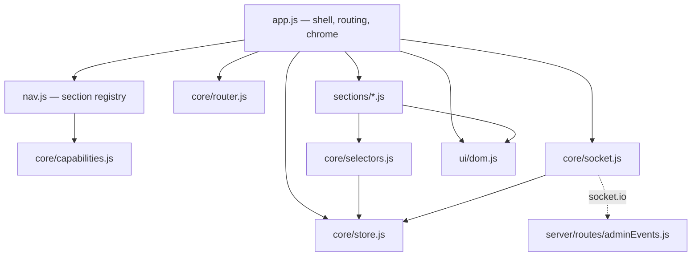

# Admin console

`client/admin/` — the operator interface. One page, served at `/admin/admin.html`,
gated by `server/routes/adminAuth.js` and driven by `server/routes/adminEvents.js`.

## Why it looks like this

The previous panel put every tool on one scrolling page: a lobby browser, a player
table, ten `
` accordions of per-player forms, a DM toolbox, and — inside a
tab called "Event Feed" — the incident list and the manual repairs. Finding
anything meant scrolling, and the thing you needed most urgently was buried
deepest.

Three properties of the rebuild follow from that:

- **Every capability has one home**, reachable in one click from a sidebar grouped
  by intent: run a game, fix a game, inspect a game.
- **Incidents are promoted to a badged top-level section**, because a broken game
  should be visible from wherever you are standing.
- **Adjust and Set sit together.** `hp:update` takes a delta, `hp:set` takes an
  absolute value; they were in different tabs. They describe the same repair and
  belong side by side.

## Shape

Data flows one way. The socket writes to the store; sections read from it and act
through the bridge. **No section touches the socket, the DOM outside its own tree,
or another section.**

## The parts

| Path | Holds |
|---|---|
| `app.js` | Boot, session/role resolution, the shell chrome, routing, section mount and teardown. |
| `nav.js` | Every section declared once: label, group, scope, required capability. |
| `core/capabilities.js` | Role → capability set. Presentation only — see below. |
| `core/router.js` | Hash routes, `#/lobby/<code>/<section>`. |
| `core/store.js` | State container. `watch` fires only when a derived value changes. |
| `core/socket.js` | The only module that knows socket.io exists. |
| `core/selectors.js` | `publicState` → view models. |
| `core/feed.js` | Socket event → activity line. |
| `core/coerce.js` | Repair-form text → server payload. |
| `core/text.js` | Escaping, whitespace, truncation. No DOM. |
| `ui/dom.js` | `h()`, `fill()`, `plainText()`. The only place the DOM is touched outside sections. |
| `sections/*.js` | One renderer per section. |

## Roles are not a security boundary

`capabilities.js` decides what is **drawn**. `isSocketAdmin()` in
`server/routes/adminEvents.js` decides what is **permitted**, and it is unchanged
by any of this. A host holding a lobby-scoped token who hand-crafts a socket frame
is stopped by the server, not by the absence of a button.

`CAP.SERVER_CONFIG` is where that distinction matters most. It gates the Providers
section, which holds the API keys that pay for **every** game on the instance —
not something a host of one game may touch. Removing it from `capabilities.js`
would hide the section, not open it: `server/routes/providerAdmin.js` never reads
a host token at all. Two locks, and the one in this file is the cosmetic one.

The host view (`?host=1&lobby=…&charId=…`, opened from
`client/eventHandlers.js`) is this same shell with the host capability set: no
lobby browser, no character-file tool, no logout. The old panel achieved that by
deleting DOM nodes after render.

## Providers

`sections/providers.js` — the operator's credential surface: who pays for chat,
narration and images, per provider. Its logic is in `core/providers.js` and is
unit tested; the renderer only arranges elements.

It is **the one section that talks to REST rather than the socket bridge**.
`/api/admin/providers` is gated on a password admin session, which the socket is
not, and a credential has no business travelling over a channel every lobby
shares. `core/socket.js` remains the only module that knows socket.io exists, and
this section does not use it.

Three behaviours worth knowing:

- **Only the policies a provider can actually take are offered.** Ollama gets
  "local" and "off"; OpenAI gets "shared", "byok" and "off". Offering all four
  everywhere would let an operator pick "shared" for a self-hosted model and then
  hunt for a key field that never appears.
- **The controls follow the policy.** The allowlist and call cap appear only for
  `shared`, the address only for `local` — mirroring the server, which discards
  fields that do not apply.
- **A key goes in and never comes back.** The field is a password input; the line
  beside it shows only `····a1B2 · working`. No response from the API carries key
  material, including failure responses, where a provider may have echoed the
  submitted key back inside its own error text.

## Testing

There is no DOM harness and this project has avoided that dependency, so the logic
lives outside the DOM: everything under `core/`, plus `nav.js` and the section
registry, is dependency-free ESM covered by `npm test`. `core/socket.js` is tested
through an injected fake socket — the bridge is the unit, the socket is a
dependency, in the same way `fetchImpl` is for the provider adapters.

What that leaves unverified is rendering itself. See `docs/testing.md`.

## State the console reads

`LobbyStore.publicState` publishes `players` as a raw record map, `initiative` as
an array of names, and `turnIndex` as a separate pointer. Deriving anything from
that is `core/selectors.js`'s job and nowhere else's — the old panel read
`initiative.current` on an array, which is why its Turn indicator showed `--` for
the life of the feature.

## The player inspector

Selecting a row in Party opens an inspector holding everything for that character.
Its shape is the point:

- **Adjust** (`admin:event` deltas) and **Set** (absolute repairs) are sibling
  columns. `hp:update` moves a value by an amount; `hp:set` moves it to one. They
  fix the same thing and were in different tabs.
- **The Set column is built from the server's catalogue**, so a repair added in
  `adminRepairs.js` appears here without a matching change — with the character
  already chosen, so the name cannot be mistyped. Two repairs are given homes of
  their own instead: `turn:set` becomes a "Give them the turn" button, and
  `player:revive` sits beside Kill, because they are each other's undo.
- **The table redraws on every state update; the inspector's forms do not.** They
  are rebuilt only when the selected character changes, so an update arriving
  mid-sentence cannot discard what is being typed. Only the vitals block redraws.

Enemies are shown under the party table. The old panel surfaced nothing about
them, so a DM running combat had to read the raw lobby JSON to see what was still
standing.

## Status

Complete. Every section in `nav.js` has a renderer, and a test enforces that.

The old single-page panel (`client/admin/admin.js`) is deleted; its behaviour is
distributed across `sections/`, and the decision record is
[ADR 0012](../decisions/0012-admin-console-as-a-routed-shell.md).

Rendering remains unverified by automated tests — see `docs/testing.md`.

_Last verified: 2026-07-27 against branch `Refactor` (aa42c8c)._
