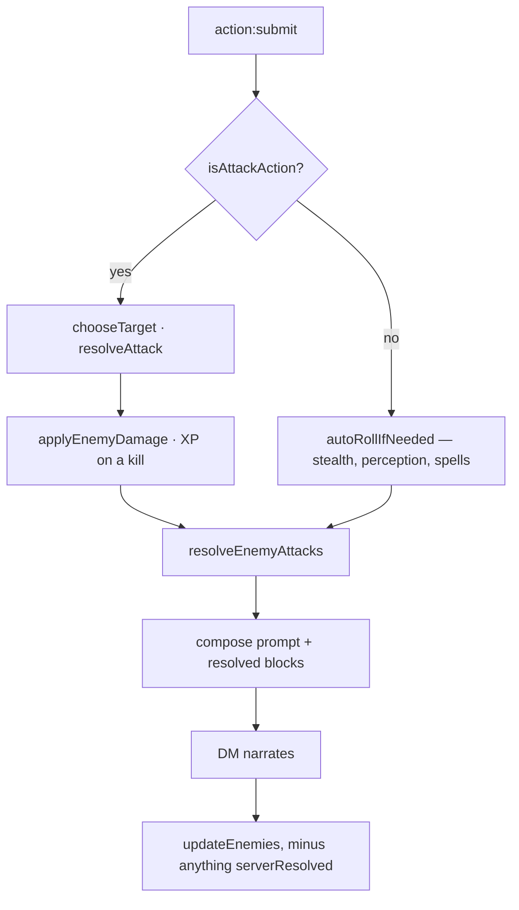

# Combat

Who rolls what, and which numbers the narrator is allowed to invent.

## The principle

None of them, where a die can decide instead. This is the third application of the
argument in [ADR 0008](../decisions/0008-xp-for-kills-is-awarded-by-the-server.md):
a model mid-prose is a poor bookkeeper and a worse random number generator, so
anything with a right answer is computed and handed to it as settled fact. XP went
first, then the enemies' attacks, then loot ([ADR 0017](../decisions/0017-loot-is-rolled-by-the-server.md)),
then the players' attacks ([ADR 0018](../decisions/0018-player-attacks-are-rolled-by-the-server.md)).

## A turn, in order

Everything mechanical happens **before** the model is called, because the narration
has to describe outcomes and so the outcomes must already exist. Resolving
afterwards would let the prose describe a clean dodge while hit points fell.

## Armour class

`services/armourClass.js`, and nowhere else. Held in two places it drifted, so the
number a player was quoted was not the one the enemies rolled against.

| Armour | Dexterity |
|---|---|
| none | full, over a base of 10 |
| light | full |
| medium | capped at +2 |
| heavy | none, in either direction |

An unrecognised type is treated as light — the DM invents armour, and dropping the
modifier for an unfamiliar word is what caused a DEX 16 rogue to be AC 13 unarmoured
and AC 11 in leather. The unarmoured value is a floor: an upgrade can never be a
downgrade.

`attributes.bonus` is added on top, but the loot engine folds its enchantment into
`ac` before the item is ever equipped, so the two do not stack.

## The players' half

`services/playerAttacks.js`.

**Target.** A named enemy wins; a bare species name ("I attack the goblin") matches
the numbered roster entry; otherwise the most wounded enemy still standing, because
finishing what the party started is what a table would do. The dead and the fled are
never targeted.

**To hit.** `d20 + ability modifier + proficiency + weapon bonus` against the
target's real `ac`. Ability is dexterity for ranged, and for a finesse weapon
whichever the character is better at. Proficiency is the 5e progression,
`2 + floor((level-1)/4)` — players previously had none at all while enemies had a
challenge-rating equivalent, so the party scaled worse than its opposition.

**Damage.** The weapon's dice + ability modifier + weapon bonus, plus any affix
`bonus_damage`, minimum 1. A natural 20 is a critical hit and doubles the dice but
not the modifiers; a natural 1 always misses.

A weapon whose `damage` is not a plain dice expression falls back to `1d4` rather
than dealing nothing — the model has invented `"1d6+1"` before now.

## The enemies' half

`services/enemyTurns.js`, unchanged by ADR 0018. Attacks are round-robin across
living characters rather than focused, because three goblins concentrating on one
level-1 character is an instant kill that reads as the engine singling somebody out.
Damage is by challenge rating, deliberately coarse.

## What the narrator may still do

Introduce enemies, with full stat blocks — that is the only way a fight starts.
Narrate everything. Apply damage from a source that is not an attack: a trap, a
fall, a collapsing ceiling.

What it may not do is decide whether a blow lands, how much it takes off, or
whether a target dies. Two mechanisms enforce that, because the prompt saying so has
never been sufficient:

- `stripResolvedDamage` drops the model's `hp` updates on a round the server
  resolved. It exists because a character was once wounded twice for one blow.
- `updateEnemies(..., { serverResolved })` refuses hit-point changes for the enemy
  this turn's attack resolved. Without it the model's own `enemies` block would
  overwrite the rolled result — including reviving something it had just killed.

XP for a server-resolved kill is awarded at the killing blow, since `updateEnemies`
never sees that death.

## Difficulty

`client/difficulty.js` — in `client/` because the settings window imports it and the
server imports it back, so the host's promise, the narrator's brief and the
arithmetic are one artifact. See [ADR 0019](../decisions/0019-difficulty-scales-the-opposition.md).

| | Casual | Standard | Hardcore | Merciless |
|---|---|---|---|---|
| Enemy attack bonus | −3 | 0 | +2 | +4 |
| Enemy damage | ×0.5 | ×1 | ×1.25 | ×1.5 |
| Enemy hit points | ×0.6 | ×1 | ×1.25 | ×1.5 |
| Party attack bonus | +3 | 0 | 0 | −1 |

Standard is a true no-op. Player *damage* is untouched at every setting — a weapon
deals what the weapon deals. Enemy hit points are scaled once, on introduction;
rescaling per update would inflate a creature without bound as the model re-sends
its block.

`describeDifficulty` renders the same table into the lines the settings window
lists under the chips and the block pasted into the DM prompt — where it is also
told the modifiers are *already applied*, or it applies them a second time.

An unrecognised difficulty gets Standard's modifiers rather than throwing, so a
combat path that forgets to pass it plays balanced rather than crashing.

## Known gaps

- **Trinket effects are not computed.** A Ring of the Veil works as well as the
  narrator remembers it.
- **Difficulty modifiers are flat, not level-scaled.** +4 to enemy attacks matters
  more at level 1 than at level 15.
- **No advantage, cover, reach, opportunity attacks or resistances.**
- **Spells and abilities are not resolved mechanically** — they still go through
  `autoRollIfNeeded`'s flat ladder and the narrator's judgement.

## Probes

| Probe | What it answers | Cost |
|---|---|---|
| `test-integration/combat-probe.mjs` | Does the roll use the real AC, does the DM narrate a miss as a miss, and does it leave the server's hit points alone? | one DM call per turn |
| `test-integration/damage-probe.mjs` | Older, and **stale** — it imports `services/llmService.js`, which no longer exists. | — |

_Last verified: 2026-07-28 against branch `Refactor` (09eb5fb)._
