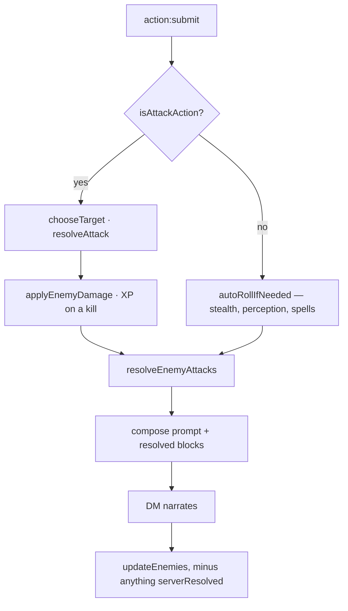

# Combat

Who rolls what, and which numbers the narrator is allowed to invent.

## The principle

None of them, where a die can decide instead. This is the third application of the
argument in [ADR 0008](../decisions/0008-xp-for-kills-is-awarded-by-the-server.md):
a model mid-prose is a poor bookkeeper and a worse random number generator, so
anything with a right answer is computed and handed to it as settled fact. XP went
first, then the enemies' attacks, then loot ([ADR 0017](../decisions/0017-loot-is-rolled-by-the-server.md)),
then the players' attacks ([ADR 0018](../decisions/0018-player-attacks-are-rolled-by-the-server.md)).

## A turn, in order

Everything mechanical happens **before** the model is called, because the narration
has to describe outcomes and so the outcomes must already exist. Resolving
afterwards would let the prose describe a clean dodge while hit points fell.

## Armour class

`services/armourClass.js`, and nowhere else. Held in two places it drifted, so the
number a player was quoted was not the one the enemies rolled against.

| Armour | Dexterity |
|---|---|
| none | full, over a base of 10 |
| light | full |
| medium | capped at +2 |
| heavy | none, in either direction |

An unrecognised type is treated as light — the DM invents armour, and dropping the
modifier for an unfamiliar word is what caused a DEX 16 rogue to be AC 13 unarmoured
and AC 11 in leather. The unarmoured value is a floor: an upgrade can never be a
downgrade.

`attributes.bonus` is added on top, but the loot engine folds its enchantment into
`ac` before the item is ever equipped, so the two do not stack.

## The players' half

`services/playerAttacks.js`.

**Target.** A named enemy wins; a bare species name ("I attack the goblin") matches
the numbered roster entry; otherwise the most wounded enemy still standing, because
finishing what the party started is what a table would do. The dead and the fled are
never targeted.

**To hit.** `d20 + ability modifier + proficiency + weapon bonus` against the
target's real `ac`. Ability is dexterity for ranged, and for a finesse weapon
whichever the character is better at. Proficiency is the 5e progression,
`2 + floor((level-1)/4)` — players previously had none at all while enemies had a
challenge-rating equivalent, so the party scaled worse than its opposition.

**Damage.** The weapon's dice + ability modifier + weapon bonus, plus any affix
`bonus_damage`, minimum 1. A natural 20 is a critical hit and doubles the dice but
not the modifiers; a natural 1 always misses.

A weapon whose `damage` is not a plain dice expression falls back to `1d4` rather
than dealing nothing — the model has invented `"1d6+1"` before now.

## The enemies' half

`services/enemyTurns.js`. Attacks are round-robin across living characters rather
than focused, because three goblins concentrating on one level-1 character is an
instant kill that reads as the engine singling somebody out. Damage is by challenge
rating, deliberately coarse.

**An NPC has one action per round, exactly as a player does.** This runs on every
`action:submit`, so without a share-out every enemy swung on every player's turn: a
party of three facing three goblins took nine attacks a round against their three,
and the penalty grew with party size.

Whether a creature has acted is recorded on the creature (`actedInRound`), and the
ones still holding an action are dealt out across the turns still to come. Tracking
it by *position* instead — slicing the living roster by the acting player's index —
looks equivalent and is not: kill one goblin mid-round and the array reindexes, so
another silently loses its turn while a third takes one it already had.

A solo character faces the whole roster on their turn, correctly, because their turn
is the round. The resolver reports `acted` and the caller records it, keeping the
resolve/apply split.

`services/enemyRound.js` wraps all of that — the round bookkeeping, the difficulty,
the party size the share-out divides by — because **two** paths need it. It lived
inside `action:submit` only, so a turn that expired on the clock reached the narrator
without an enemy round and the enemies simply did not attack: standing still was
mechanically safer than acting, which in a hard fight is the optimal play. A live
merciless idle now costs 26 hit points where it used to cost nothing.

**Multiattack is the exception.** A stat block carrying `multiattack` (or `attacks`)
swings that many times *within its one action*, so it still cannot come round again
later in the round. Capped at 4 — the model writes these, and 50 is a typo.

**No single blow takes more than three-quarters of a character's maximum hit
points.** A character at full health survives any one hit; two still kill. It caps a
blow and not a turn, so a wounded character is in as much danger as ever.

## What the narrator may still do

Introduce enemies, with full stat blocks — that is the only way a fight starts.
Narrate everything. Apply damage from a source that is not an attack: a trap, a
fall, a collapsing ceiling.

What it may not do is decide whether a blow lands, how much it takes off, or
whether a target dies. Two mechanisms enforce that, because the prompt saying so has
never been sufficient:

- `stripResolvedDamage` drops the model's `hp` updates on a round the server
  resolved. It exists because a character was once wounded twice for one blow.
- `updateEnemies(..., { serverResolved })` refuses hit-point changes for the enemy
  this turn's attack resolved. Without it the model's own `enemies` block would
  overwrite the rolled result — including reviving something it had just killed.

XP for a server-resolved kill is awarded at the killing blow, since `updateEnemies`
never sees that death.

## Difficulty

`client/difficulty.js` — in `client/` because the settings window imports it and the
server imports it back, so the host's promise, the narrator's brief and the
arithmetic are one artifact. See [ADR 0019](../decisions/0019-difficulty-scales-the-opposition.md).

| | Casual | Standard | Hardcore | Merciless |
|---|---|---|---|---|
| Enemy attack bonus | −3 | 0 | +6 | +9 |
| Enemy damage | ×0.5 | ×1 | ×1.5 | ×2 |
| Enemy hit points | ×0.7 | ×1 | ×1 | ×1 |
| Party attack bonus | +3 | 0 | −1 | −1 |

Tuned against `balance-sim.mjs`, not guessed — see
[ADR 0020](../decisions/0020-combat-balance-measured-not-guessed.md). Standard is a
true no-op, and player *damage* is untouched at every setting.

Hit points scale only *downward*, on Casual, and only when the enemy is introduced.
A multiplier is disproportionate for a big monster — ×1.4 adds three hit points to a
goblin and twenty-four to an ogre — so above Standard the same setting was a mild
handicap against a horde and unwinnable against a single brute.

Hit chance is preferred to damage as the lever: an attack bonus saturates, while a
damage multiplier compounds. At ×2 a CR 2 ogre one-shot a level 3 character in 82% of
simulated fights, which is what the one-blow cap prevents.

Measured, 4000 fights per encounter:

| | Casual | Standard | Hardcore | Merciless |
|---|---|---|---|---|
| Party win rate | 100% | 99–100% | 36–93% | 21–79% |
| Solo win rate | 100% | 84% | 36% | 21% |
| One-shot rate | 0% | 0% | 0% | 0% |

These supersede the figures quoted in ADR 0020, which were measured before enemy
actions became per-creature rather than positional. That change made the party's
position slightly better, most visibly against a single large monster — it could
previously act more than once a round when a party member died and the share-out
reindexed.

`describeDifficulty` renders the same table into the lines the settings window
lists under the chips and the block pasted into the DM prompt — where it is also
told the modifiers are *already applied*, or it applies them a second time.

An unrecognised difficulty gets Standard's modifiers rather than throwing, so a
combat path that forgets to pass it plays balanced rather than crashing.

## Known gaps

- **Trinket effects are not computed.** A Ring of the Veil works as well as the
  narrator remembers it.
- **Difficulty modifiers are flat, not level-scaled.** +9 to enemy attacks matters
  more at level 1 than at level 15.
- **The out-of-character and rest paths take no enemy round.** Only acting and timing
  out do. That is probably right, but it is not a considered decision.
- **No advantage, cover, reach, opportunity attacks or resistances.**
- **Spells and abilities are not resolved mechanically** — they still go through
  `autoRollIfNeeded`'s flat ladder and the narrator's judgement.

## Probes

| Probe | What it answers | Cost |
|---|---|---|
| `test-integration/balance-sim.mjs` | Can a party actually win? Win and one-shot rates per difficulty, over thousands of fights through the real resolvers. | free — no model |
| `test-integration/idle-turn-probe.mjs` | Does letting the clock run out still cost you? Stages a fight, then does nothing. | slow — the timer clamps to a minute |
| `test-integration/combat-probe.mjs` | Does the roll use the real AC, does the DM narrate a miss as a miss, and does it leave the server's hit points alone? | one DM call per turn |
| `test-integration/damage-probe.mjs` | Older, and **stale** — it imports `services/llmService.js`, which no longer exists. | — |

## Initiative, and what happens when somebody leaves

The order is **players only**. Enemies are a separate roster and take their actions
through the share-out described above, so nothing about an enemy dying touches
initiative.

`removeFromTurnOrder` is the single path out of the order, used by death
(`gameUpdates`), an admin kill, a disconnect, and the inactivity kick. It adjusts
`turnIndex` so the same player stays current:

| Removed | Effect |
|---|---|
| before the current turn | index shifts back |
| the current turn, mid-order | the next player slides into the slot |
| the current turn, last in order | wraps to the top **and advances the round** |
| after the current turn | nothing |

That last row is easy to miss. Removing the last player in the order wraps it, and a
wrap *is* a round — swallowing it stalls the round counter, and anything tracked per
round, such as an enemy's one action, never comes back. `nextTurn` cannot catch this
afterwards, because by then the index is already at the top and the wrap looks like an
ordinary step.

### Reaching the UI

Every removal path emits `turn:update`, which carries the fresh order. The initiative
window (`client/components/initiative.html`) listens to that *and* to `state:update`,
so it re-renders on both. The enemy list it draws comes from `state:update` only,
which the action handler emits on both the success and the parse-failure path — so an
enemy killed on a turn whose narration failed to parse still disappears.

_Last verified: 2026-07-29 against branch `Refactor` (eb72a9f)._
