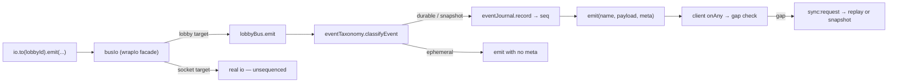

# Module: realtime delivery

How a state change reaches every player, and what happens when one of them misses it.

## The problem this solves

Socket.IO does not buffer room broadcasts for a member who is momentarily
disconnected, and it issues a new `socket.id` on every reconnect. Because lobby
membership, room membership and turn order were all keyed to that id, a player
whose connection blipped came back in no room at all — receiving nothing, their
actions answered with "Unknown player" — while the party had been told they left
and their name pulled from initiative. Nothing on their screen changed.

Two independent mechanisms address it. Identity survives the transport, and every
state-bearing broadcast is numbered so a gap is detectable.

## Sequencing

`meta` rides as a **third emit argument** — `{lid, seq, epoch, ts}` — so the ~45
existing handlers written as `socket.on("turn:update", ({current}) => …)` ignore
it and needed no edits.

**Event classes** (`eventTaxonomy.js`). Durable events are sequenced and replayed.
Snapshots (`state:update`) are sequenced but never replayed — only the newest has
meaning. Ephemeral events are neither, because replaying a countdown, an audio
chunk or a sound effect is wrong rather than merely redundant: the moment they
described has passed. An unclassified event defaults to durable, because this
system's failure mode is silent drift, and a redundant idempotent re-apply is the
cheaper mistake.

**Replay is only sound because payloads carry absolute post-values.** `hp:update`
sends `hp`, not just `delta`. Anything added later that sends only a delta breaks
replay silently — that is the constraint to protect.

**`epoch`** is process boot time. The journal is memory-only, so a restart resets
the counter; a changed epoch tells the client to take a snapshot rather than
mistake the reset for events going backwards.

## Identity and grace

`playerSessions.js` issues a token when the server first knows who a player is.
Presented on reconnect (`session:resume`), it rebinds the session to the new socket,
restores room membership and the turn-order seat, and clears the disconnected flag.

A disconnect starts a **90-second grace window** rather than an eviction. The seat
and initiative position are held; the table is told the player is *reconnecting*.
A sweeper releases the seat only if they genuinely fail to return.

Two things that must stay true, both learned by breaking them:

- `markDisconnected` ignores a socket that no longer owns its session. Socket.IO
  can deliver an old socket's teardown *after* the client reconnected on a new one,
  and treating that as a fresh disconnect ejects the player who just returned.
- `resolveActiveTurn` (`turnTimer.js`) must consult the grace window. It removes any
  player whose socket is dead and runs on every turn change, so without the check it
  silently undid the grace a second after it was granted.

## Wire protocol

| Event | Direction | Payload |
|---|---|---|
| `session:token` | server → one socket | `{token, lobbyId, seq, epoch}` |
| `session:resume` | client → server | `{token}` |
| `session:resumed` | server → one socket | `{ok, playerName, seq, epoch}` or `{ok:false, reason}` |
| `sync:request` | client → server (ack) | `{lobbyId, haveSeq, haveEpoch}` |
| — ack reply | server → client | `{mode:"replay", events[]}` / `{mode:"snapshot", seq, state}` / `{mode:"denied"}` |
| `player:reconnecting` | server → room | `{player}` |
| `player:left` | server → room | `{player}` — only after grace lapses |

`sync:request` answers through an acknowledgement callback rather than an event, so
replayed events never re-enter the client's own gap detector.

### Audiences

Two rooms exist per lobby. `room(lobbyId)` is the game — everyone in it, players
included. `adminRoom(lobbyId)` is `admin:<lobbyId>`, joined by admins *in addition
to* the game room, and carries traffic players must not see.

Anything addressed to the admin room must stay there. `debug:llm` and `debug:setup`
carry the DM's raw JSON — hidden DCs, full enemy stat blocks, and every mechanical
update before it is applied — and were once broadcast to the whole game room, where
any player with devtools open could read the numbers they were about to roll
against. Incidents are admin-facing for the same reason: they name providers,
models and internal field names.

The helper is defined in `server.js` and injected into `routes/adminEvents.js`, so
the room name has one definition rather than a literal in each file.

_Last verified: 2026-07-27 against branch `Refactor`._

## Incidents and manual repair

`incidents.js` records anything the server cannot heal itself, per lobby, and pushes
it live to admins watching that lobby (`admin:<lobbyId>` room — separate from the game
room, so incident traffic never reaches players).

The case that motivated it: the Dungeon Master narrates that a player took nine
damage, the name it used matches no character, `findPlayerKey` returns null, and the
update is discarded. The only trace was a `console.warn`. The player watches their HP
not change and has no way to find out why.

Identical incidents collapse into one record with a count, so a fault recurring every
turn reads as one ongoing problem rather than fifty. Resolution marks rather than
deletes, keeping the history of what went wrong and what was done.

`adminRepairs.js` is the other half — the fixes, driven from a catalogue the admin UI
renders, so a repair added server-side appears in the panel without a matching UI
change:

| Repair | Why it exists |
|---|---|
| `player:revive` | Nothing else can clear the `dead` flag |
| `hp:set` | Absolute, unlike the delta-only admin events |
| `slots:set` | Nothing else refills ability uses outside a long rest |
| `conditions:set` | Replaces the list; conditions otherwise clear only on a long rest |
| `turn:set` | Hand the turn to a named player |
| `order:rebuild` | Recovery when the order is empty, duplicated, or holds someone gone |
| `ui:unlock` | Frees a table stuck behind a lock that was never lifted |
| `resync:force` | Pushes fresh state to every client |

They are **absolute operations, not deltas**, deliberately: correcting a wrong number
should not require an admin to compute a difference — least of all when the number is
wrong because something was applied twice, which is exactly when that arithmetic
cannot be trusted. Every repair ends with a state broadcast, because a fix players
cannot see has only corrected the server's record, not their experience.
